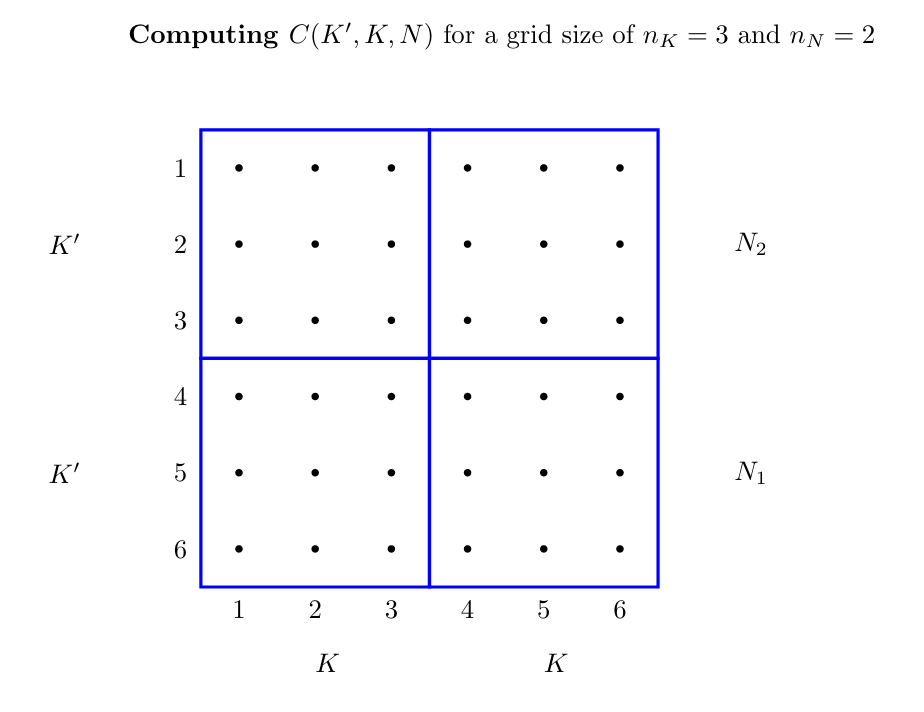

= Computational Tools

:stem: latexmath
:eqnums:

You can use the following websites to run your (R, julia, Rust) code online, without having to install anything:

* link:https://rextester.com/l/r_online_compiler[Execute R codes online]
* link:https://repl.it/languages/julia[Execute Julia code online]
* link:https://www.tutorialspoint.com/compile_rust_online.php[Compile Rust code online]
* link:https://rextester.com/l/octave_online_compiler[Execute Octave code online]

== Slice sampler

This part is taken from link:https://www.springer.com/gp/book/9780387212395[Robert and Casella (2004)].

At iteration _t_, simulate:

\begin{eqnarray}
 u^{(t+1)} &\sim& U_{[0,f(x^{(t)}]} \nonumber \\
 x^{(t+1)} &\sim& U_{A^{(t+1)}} \nonumber
\end{eqnarray}
with $A^{(t+1)} = \{ x: f(x) \geq u^{(t+1)} \}$

=== Example 1

In this example, the _slice sampler_ will be used to simulate from the density:
\[
f(x)=\frac{1}{2}\exp( -\sqrt{x} )
\]

At iteration _t_, simulate:
\begin{eqnarray}
 u^{(t+1)} &\sim& U_{[0,\frac{1}{2}\exp( -\sqrt{x} )]} \nonumber \\
 x^{(t+1)} &\sim& U_{[0,(-\log(2u))^2]} \nonumber
\end{eqnarray}

Using *R*

[source,R]
----
# Sample from 0.5*exp(-sqrt(x))
# using the slice sampler

f <- function(y)exp(-sqrt(y))/2;

nsim <- 50000;

x <- array(0,dim=c(nsim,1));
x[1] <- -log(runif(1));

for (i in 2:nsim)  {
     w <- runif(1,min=0,max=f(x[i-1]));
     x[i] <- runif(1,min=0,max=(-log(2*w))^2);
}

hist(x,main="Slice sample",xlim=c(0,60),ylim=c(0,.25),freq=F,col="green",breaks=250)

par(new=T)

plot(function(y)f(y), 0, 70, xlim=c(0,60),ylim=c(0,.25),xlab="",ylab="",xaxt="n",yaxt="n",lwd=3)

----

Using *julia*

[source,julia]
----

using Random, Distributions

# Setting the seed
Random.seed!(123)

function f(y)
    exp( -sqrt(y) ) / 2
end

nsim = 50000

x = rand(Uniform(0.0,1.0),nsim,1)

x[1] = -log.( rand(Uniform(0.0,1.0)) )

for i in 2:nsim
    w = rand(Uniform(0.0,f(x[i-1])))
    x[i] = rand(Uniform(0.0,(-log.(2*w))^2))
end

# Histogram of density
using Plots; pyplot()
Plots.PyPlotBackend()
histogram(x)

----

=== Example 2
Now we consider a truncated normal distribution $\mathcal{N}$(3,1), which is restricted to the interval [0,1].

In this example, the _slice sampler_ will be used to simulate from the density:
[stem]
++++
f(x) \varpropto f_1(x) = \exp\big( -(x+3)^2/2 \big) \mathbb{1}_{[0,1]}{(x)}
++++

At iteration _t_, simulate:
\begin{eqnarray}
 u^{(t+1)} &\sim& \exp\big( -(x+3)^2/2 \big) U_{[0,1]} \nonumber \\
 x^{(t+1)} &\sim& U_{[0,(-3+\sqrt{-2\log(u)})]} \nonumber
\end{eqnarray}

[source,R]
----

# Sample from a N(-3,1) truncated to [0,1]
# using the slice sampler

nsim = 1000

obs <- matrix(0,nsim,2)
obs[1,1] = .25
obs[1,2] = 0.5*exp(-0.5*(obs[1,1]+3)^2)

for (i in 2:nsim){
 obs[i,2] = exp(-0.5*(obs[i-1,1]+3)^2)*runif(1)
 obs[i,1] = runif(1)*min(1,-3+sqrt(-2*log(obs[i,2])))
 }

hist(obs,main="Slice sample",freq=F,col="green", breaks=25)

----

== Monte Carlo Integration

Consider the function,
\begin{eqnarray}
  h(x) = [ \cos(50x) + \sin(20x) ]^2 \nonumber
\end{eqnarray}

The integral,
\begin{eqnarray}
  \int^1_0 h(x) dx \nonumber
\end{eqnarray}
can be calculated by generating
\[
   U_1, U_2, \ldots, U_n  \sim  iid \quad U(0,1)
\]
random variables, and approximate $\int h(x) dx$ with
\[
   \sum^n_{i=1} h(U_i)/n
\]

Using *R*

[source,R]
----

nsim <- 10000;
u <- runif(nsim);
den <- 1:(nsim)

# The function to be integrated
mci.ex <- function(x){(cos(50*x)+sin(20*x))^2}
par(mfrow=c(1,3))
plot(function(x)mci.ex(x), xlim=c(0,1),ylim=c(0,4),xlab="Function",ylab="")

# The Monte Carlo sum
## Generated Values of Function
hint <- mci.ex(u)
## Mean
hplot <- cumsum(hint)/den
## Standard Errors
stdh <- sqrt( cumsum(hint^2)/den - (hplot)^2)
upper <- hplot+stdh/sqrt(den)
lower <- hplot-stdh/sqrt(den)

----

== Simulated Annealing

Given a _temperature_ parameter $T>0$, a sample $\theta^T_1, \theta^T_2, \ldots$ is generated from the distribution
\[
 \pi(\theta) \varpropto \exp( h(\theta)/T )
\]

=== Example 3

We are searching for the maximum of the following function
\[
  h(x) = [ \cos(50x) + \sin(20x) ]^2
\]
Note: Variable

At iteration _t_ the algorithm is at $( x^{(t)},h^{(t)} )$:

. Simulate $u \sim U(a_t, b_t)$ where $a_t = \max( x^{(t)}-r,0 )$ and $b_t = \min( x^{(t)}+r,1 )$
. Accept $x^{(t+1)}=u$ with probability
\[
  \rho^{(t)} = \min \big\{  \exp \big(  \frac{h(u)-h(x^{(t)})}{T_t} \big), 1  \big\}
\]
take $x^{(t+1)}=x^{(t)}$ otherwise.
. Update $T_t$ to $T_{t+1}$

[source,R]
----

par(mfrow=c(1,2))

# The function to be optimized
mci <- function(x){(cos(50*x)+sin(20*x))^2}

# The Monte Carlo maximum
nsim <- 2500
u <- runif(nsim)

# Simulated annealing
xval <- array(0,c(nsim,1));
r <- .5
for(i in 2:nsim){
    test <- runif(1, min=max(xval[i-1]-r,0),max=min(xval[i-1]+r,1));
    delta <- mci(test) - mci(xval[i-1]);
    rho <- min(exp(delta*log(i)/1),1);
    xval[i] <- test*(u[i]<rho)+xval[i-1]*(u[i]>rho)
}
mci(xval[nsim])

# Plot the trajectory of the optimization path
plot(function(x)mci(x), xlim=c(0,1),ylim=c(0,4),xlab="Function",ylab="")
plot(xval,mci(xval),type="l",lwd=2)

----

== Metropolis-Hastings Algorithm

Let $q(\theta, \vartheta)$ be a _proposal density_ or a _candidate-generating density_ (link:http://www2.stat.duke.edu/~scs/Courses/Stat376/Papers/Basic/ChibGreenberg1995.pdf[Chib and Greenberg, 1995]) such that
\[
 \int q(\theta, \vartheta) d\vartheta = 1
\]
Also let $U(O, 1)$ denote the uniform distribution over $(0, 1)$. Then, a general version of the Metropolis- Hastings algorithm for sampling from the posterior distribution $\pi(\theta,D)$ can be described as follows:

. Choose an arbitrary starting point $\theta_0$ and set $i=0$.
. Generate a candidate point $\theta^*$ from $q(\theta_i,\cdot)$ and $u$ from $U(0,1)$.
. Set $\theta_{i+1}=\theta^*$ if $u \leq a(\theta_i, \theta^*)$ and $\theta_{i+1}=\theta_i$ otherwise, where the acceptance probability is given by
\[
 a(\theta,\vartheta) = \min\big\{
                        \frac{ \pi(\vartheta|D)q(\vartheta, \theta) }{ \pi(\theta|D)q(\theta, \vartheta) },
                        1
                        \big\}
\]
. Set $i=i+1$, and go to Step 2.

=== Example 4

Let us consider the following simple linear model:
\[
 y_t = \alpha x_t + \beta + \epsilon_t
\]
where $\epsilon \sim N(0, \sigma^2)$.

_Source_: R code taken from link:https://theoreticalecology.wordpress.com/2010/09/17/metropolis-hastings-mcmc-in-r/[A simple Metropolis-Hastings MCMC in R]

[source,R]
----

### Creating test data
trueA <- 5
trueB <- 0
trueSd <- 10
sampleSize <- 31

# create independent x-values
x <- (-(sampleSize-1)/2):((sampleSize-1)/2)
# create dependent values according to ax + b + N(0,sd)
y <-  trueA * x + trueB + rnorm(n=sampleSize,mean=0,sd=trueSd)

plot(x,y, main="Test Data")

### Deriving the likelihood
likelihood <- function(param){
    a = param[1]
    b = param[2]
    sd = param[3]

    pred = a*x + b
    singlelikelihoods = dnorm(y, mean = pred, sd = sd, log = T)
    sumll = sum(singlelikelihoods)
    return(sumll)
}

# Example: plot the likelihood profile of the slope a
slopevalues <- function(x){return(likelihood(c(x, trueB, trueSd)))}
slopelikelihoods <- lapply(seq(3, 7, by=.05), slopevalues )
plot (seq(3, 7, by=.05), slopelikelihoods , type="l", xlab = "values of slope parameter a", ylab = "Log likelihood")

### Defining the prior
# Prior distribution
prior <- function(param){
    a = param[1]
    b = param[2]
    sd = param[3]
    aprior = dunif(a, min=0, max=10, log = T)
    bprior = dnorm(b, sd = 5, log = T)
    sdprior = dunif(sd, min=0, max=30, log = T)
    return(aprior+bprior+sdprior)
}

### Defining the posterior
posterior <- function(param){
   return (likelihood(param) + prior(param))
}

######## Metropolis algorithm ################

proposalfunction <- function(param){
    return(rnorm(3,mean = param, sd= c(0.1,0.5,0.3)))
}

run_metropolis_MCMC <- function(startvalue, iterations){
    chain = array(dim = c(iterations+1,3))
    chain[1,] = startvalue
    for (i in 1:iterations){
        proposal = proposalfunction(chain[i,])

        probab = exp(posterior(proposal) - posterior(chain[i,]))
        if (runif(1) < probab){
            chain[i+1,] = proposal
        }else{
            chain[i+1,] = chain[i,]
        }
    }
    return(chain)
}

startvalue = c(4,0,10)
chain = run_metropolis_MCMC(startvalue, 10000)

burnIn = 5000
acceptance = 1-mean(duplicated(chain[-(1:burnIn),]))

### Summary: #######################

par(mfrow = c(2,3))
hist(chain[-(1:burnIn),1],nclass=30, , main="Posterior of a", xlab="True value = red line" )
abline(v = mean(chain[-(1:burnIn),1]))
abline(v = trueA, col="red" )
hist(chain[-(1:burnIn),2],nclass=30, main="Posterior of b", xlab="True value = red line")
abline(v = mean(chain[-(1:burnIn),2]))
abline(v = trueB, col="red" )
hist(chain[-(1:burnIn),3],nclass=30, main="Posterior of sd", xlab="True value = red line")
abline(v = mean(chain[-(1:burnIn),3]) )
abline(v = trueSd, col="red" )
plot(chain[-(1:burnIn),1], type = "l", xlab="True value = red line" , main = "Chain values of a", )
abline(h = trueA, col="red" )
plot(chain[-(1:burnIn),2], type = "l", xlab="True value = red line" , main = "Chain values of b", )
abline(h = trueB, col="red" )
plot(chain[-(1:burnIn),3], type = "l", xlab="True value = red line" , main = "Chain values of sd", )
abline(h = trueSd, col="red" )

# for comparison:
summary(lm(y~x))

----

The following table gives the equivalence of the variables used in the pseudo-code to the variables used in the R code:

[%header,cols=2*]
|===
|Theory
|Code

|$\theta$
|chain[,]

|$u$
|runif(1)

|$a(\theta_i, \theta^*)$
|probab

|$\min \big\{  \frac{\pi(\vartheta\|D)q(\vartheta,\theta)}{\pi(\theta\|D)q(\theta,\vartheta)}  \big\}$
|exp( posterior(proposal) - posterior(chain[i,]) )

|$\theta_0$
|c(4,0,10)

|$\theta^*$
|proposal
|===

== Dynamic programming and value function iteration

Consider the following dynamic optimization problem:
\[
 \max_{ \{ x_{t+1} \}^{\infty}_{t=0} } \Sigma^{\infty}_{t=0}\beta^t F(x_t, x_{t+1}) \\
 \mbox{s.t.} \quad  x_{t+1} \in \Gamma(x_t)
\]

The _functional equation_ of the previous problem is given by:
\[
 v(x) = \max_{y\in \Gamma(x)} \big[ F(x,y) + \beta v(y) \big]
\]

Introducing the _optimal policy function_ $g$, we can rewrite the previous expression:
\[
 v(x) = F\big[ x, g(x) + \beta v[g(x)] \big]
\]

The _first-order condition_ and the _envelope condition_ is defined as:
\begin{eqnarray}
 0 &=& F_y[ x, g(x) ] + \beta v'[g(x)] \nonumber \\
 v'(x) &=& F_x[ x, g(x) ] \nonumber
\end{eqnarray}

The _Euler equation_ and the _transversality condition_ is given by:
\begin{eqnarray}
 0 &=& F_y(x_t, x_{t+1}) + \beta F_x (x_{t+1}, x_{t+2}), \quad t=0,1,2, \ldots \nonumber \\
 0 &=& \lim_{t\rightarrow \infty} \beta^t F_x(x_t, x_{t+1}) \cdot x_t \nonumber
\end{eqnarray}

=== Example 5

*The Model*

Let us consider the following _functional equation_:
\[
 v(k) = \max_{k'\geq 0} \big\{  U\big( f(k)-k' \big) + \beta v(k') \big\}
\]
with $k'+c\leq f(k)$, $c\geq 0$ and $y=f(k)$

The model is specified as follows:
\[
  f(k) = k^{\alpha} \\
  U(c) = \log(c)
\]
and it is parameterized as follows
\begin{eqnarray}
 \alpha &=& 0.3 \nonumber \\
 \beta &=& 0.9 \nonumber
\end{eqnarray}

*First Order and Envelope Conditions*

\begin{eqnarray}
 v(k) &=& \max_{c,k'} \big\{ U(c) +  \beta v(k') \big\} \nonumber \\
 && \mbox{s.t.} \quad f(k) - k' - c \geq 0 \quad \quad  [\lambda] \nonumber
\end{eqnarray}

\begin{eqnarray}
 \frac{\partial v(k)}{\partial k'} = 0 \iff \beta \frac{\partial v(k')}{\partial k'} - \lambda = 0 \nonumber
\end{eqnarray}

\begin{eqnarray}
 \boxed{\lambda = \beta \frac{\partial v(k')}{\partial k'} } \nonumber
\end{eqnarray}

\begin{eqnarray}
 \frac{\partial v(k)}{\partial k} &=& \beta \frac{\partial v(k')}{\partial k'}
                                        + \lambda \big[ \frac{\partial f(k)}{\partial k} - \frac{k'}{k} \big]
                                        \nonumber \\
                                &=& \underbrace{\big[ \beta \frac{\partial v(k')}{\partial k'} - \lambda \big]}_{=0} \frac{k'}{\partial k} + \lambda \frac{\partial f(k)}{\partial k}
                                \nonumber
\end{eqnarray}
which yields the _envelope condition_
\[
 \boxed{ \frac{\partial v(k')}{\partial k'} = \lambda' \frac{\partial f(k')}{\partial k'} }
\]

By combining the two boxed expressions, we get the _first-order condition_
\[
 \boxed{ \lambda = \lambda' \beta \frac{\partial f(k')}{\partial k'} }
\]
and
\[
 \frac{\partial v(k)}{\partial c} = 0 \iff \frac{\partial U(c)}{\partial c} - \lambda = 0
\]

\[
 \boxed{ \lambda = \frac{\partial U(c)}{\partial c} }
\]

*Steady-state*

By combining the _first-order condition_ with the following expressions
\begin{eqnarray}
 \frac{\partial U(c)}{\partial c} &=& c^{-1} \nonumber \\
 \frac{\partial f(k)}{\partial k} &=& \alpha k^{\alpha-1} \nonumber
\end{eqnarray}
we can find the _steady-state value_ of $k$
\[
  k^* = \Bigg( \frac{1}{\alpha\beta} \Bigg)^{\frac{1}{\alpha-1}}
\]

*Numerical Solution*

The _numerical solution algorithm_ (value function iteration) is given by (link:https://papers.ssrn.com/sol3/papers.cfm?abstract_id=1120686[Heer and Maussner, 2008]):

. Choose a grid
 $\mathcal{K} = [ K_1, K_2, \ldots, K_n]$  with  $K_i < K_j$ and $i < j = 1$,$2$,$\ldots$, $n$

. Initialize the value function: $\forall i = 1, \ldots, n$ set
\[
 v_i^0 = \frac{u(f(K^*)-K^*)}{1-\beta}
\]
where $K^*$ denotes the stationary solution to the initial problem
. Compute a new value function and the associated policy function, $\underline{v}^1$ and $\underline{h}^1$ respectively: Put $j^*_0 \equiv 1$. For $i=1,2,\ldots , n$ and $j^*_{i-1}$ find the index $j^*_i$ that maximizes
\[
 u\big( f(K_i)-K_j \big) + \beta v^0_j
\]
in the set of indices $\{ j^*_{i-1}, j^*_{i-1}+1, \ldots, n \}$. Set $h^1_i=j^*_i$ and $v^1_i=u\big( f(K_i)-K_{j^*_i} \big) + \beta v^0_{j^*_i}$
. Check for convergence: If $\parallel \underline{v}^0-\underline{v}^1 \parallel_{\infty} < \epsilon (1-\beta)$, $\epsilon \in \mathbb{R}_{++}$ stop, else replace $\underline{v}^0$ with $\underline{v}^1$ and $\underline{h}^0$ with $\underline{h}^1$ and return to step 3.

Using *Octave*

[source,Octave]
----

% Deterministic Growth model
% Original code by Joao Ejarque and Russell Cooper
% Tarik OCAKTAN - Paris - May 2009

% State space dimension = 1

% Notation:
%  pName : structural parameters
%  iName : total number of variables related to the algorithm
%  idxName : indexation used in loops, i.e. idxName = 1,...,iName
%  dName : integer of a specific value of a variable, i.e. dNamess=steady state
%          of
%							   variable 'Name'
%  vName : vector containing values of variable 'Name'
%  mName : matrix containing values of a variable 'Name'

clear;clc;
close all;

% Structural parameters
pAlpha	= .3;
pBeta	= .9;

% Algorithm parameters
 iIter = 2000; % maximum number of iterations
 iGridPoints = 300;
 iToler	= 10e-6;  % convergence criterion
% Steady state value
 dKss = ( 1 / (pAlpha*pBeta) )^( 1 / (pAlpha-1) );
% Bounds of state space
 dKmin	= dKss * 0.9;
 dKmax	= dKss * 1.1;
% Construct a grid
 iStep	= (dKmax-dKmin) / (iGridPoints-1);
 vK	= dKmin:iStep:dKmax;
 iGridPoints = size(vK,2); % overwriting iGridPoints in order to take into
			   % account additional point

vY = vK.^pAlpha;
vIota = ones(iGridPoints,1);

% Budget constraint
mC = vIota*vY - vK'*vIota';

% Eliminate negative or zero consumption values
mCP	= mC > 0;  % Matrix of ones where C>0 and zeros elsewhere
mPC	= 1 - mCP; % Matrix with ones where C<=0. this is a penalty matrix
z	= 10e-5;
mC	= mC.*mCP + z*mPC;

% Initialization
 % Initializing the utility function mU
 mU = log(mC);

 % Initializing the value function vVNew
 mCF = vIota*vY ;
 mVNew = log(mCF);

 % Initializing the value function vVOld
 vVOld = max([ mU + pBeta*mVNew ]);

%%% Main Iteration - BEGIN %%%
for idxIter=1:iIter

 idxIter

 vVNew = max([ mU + pBeta*(vIota*vVOld)' ]);

 iDiff = ( abs(vVOld-vVNew) ) / vVOld;
 if abs(iDiff) <= iToler
  vVOld = vVNew;
  break
 else
  vVOld = vVNew;
 end

end
%%% Main Iteration - END %%%

%break

% Construct policy function
[maxR,idxR] = max([ mU + pBeta*(vIota*vVOld)' ]);

vKP  = vK(idxR);
vInv = vKP;

figure(1)
plot(vK,vKP)
figure(2)
plot(vK,vY)
disp(idxIter)

----

*Alternative version*
TBD

[source,Octave]
----

% Deterministic Growth model
% Original code by Eric Sims
% Tarik OCAKTAN - Luxembourg - November 2020

% State space dimension = 1

% Notation:
%  pName : structural parameters
%  iName : total number of variables related to the algorithm
%  idxName : indexation used in loops, i.e. idxName = 1,...,iName
%  dName : integer of a specific value of a variable, i.e. dNamess=steady state
%          of
%							   variable 'Name'
%  vName : vector containing values of variable 'Name'
%  mName : matrix containing values of a variable 'Name'

clear;clc;
close all;

global v0 pBeta pDelta pAlpha vK k0 s

% Structural parameters
pAlpha	=  .33;
pBeta	=  .95;
pDelta  = 0.1;
s       = 2;

% Value function
function val=valfun(k)

    % This program gets the value function for a neoclassical growth model with
    % no uncertainty and CRRA utility
    global v0 pBeta pDelta pAlpha vK k0 s
    g = interp1(vK,v0,k,'linear'); % smooths out previous value function
    c = k0^pAlpha-k + (1-pDelta)*k0; % consumption
    if c<=0
        val =-888888888888888888-800*abs(c); % keeps it from going negative
    else
        val=(1/(1-s))*(c^(1-s)-1) + pBeta*g;
    end
    val =-val; % make it negative since we're maximizing and code is to minimize.

endfunction

% Algorithm parameters
 iIter = 1000; % maximum number of iterations
 iGridPoints = 4;
 iToler	= 0.01;  % convergence criterion

% Steady state value
 dKss = (pAlpha/(1/pBeta-(1-pDelta)))^(1/(1-pAlpha));
 dCss = dKss^(pAlpha)-pDelta*dKss;
 dIss = pDelta*dKss;
 dYss = dKss^pAlpha;

% Bounds of state space
 dKmin	= dKss * 0.25;
 dKmax	= dKss * 1.75;
% Construct a grid
 iStep	= (dKmax-dKmin) / (iGridPoints-1);
 vK	= [dKmin:iStep:dKmax]';
 iGridPoints = size(vK,1); % overwriting iGridPoints in order to take into
			   % account additional point

 polfun = zeros(iGridPoints,1);

 v0 = zeros(iGridPoints,1);

 iDif = 10;
 idxIter = 0;

while iDif>iToler && idxIter<iIter

    for i = 1:iGridPoints

        k0 = vK(i,1);
        k1 = fminbnd(@valfun,dKmin,dKmax);
        v1(i,1) = -valfun(k1);
        k11(i,1) = k1;

    end

iDif = norm(v1-v0);
v0 = v1;
idxIter = idxIter+1;

end

break

for i = 1:iGridPoints
    con(i,1) = vK(i,1)^(pAlpha)-k11(i,1) + (1-pDelta)*vK(i,1);
    polfun(i,1) = vK(i,1)^(pAlpha)-k11(i,1) + (1-pDelta)*vK(i,1);
end

----

*Alternative version*
This julia code contains an error and will be fixed soon ...

link:https://tarikgit.github.io/coding/dynamicprogramming/vfi-1D-julia.html[Julia code for value function iteration of a 1D problem.]

=== Example 6

Let us consider the following _two-dimensional deterministic model_:
\begin{eqnarray}
 v(k,n) = \max_{ n',k',c }
    \Bigg\{
     U(c) - G(n) &+& \beta v(k',n')
    \Bigg\}  \nonumber \\
     \mbox{ s.t. } \quad f(k,n)-k'-c-(1-n) &\geq& 0 \quad [\lambda] \nonumber \nonumber \\
     \quad \quad \quad (1-s)n + p(1-n) - n' &\geq& 0 \quad [\mu] \nonumber
\end{eqnarray}

The first-order conditions describing the dynamics of this system are given by:

\begin{eqnarray}
k^{\theta} n^{1-\theta} - k' - c - 1 + n &=& 0 \nonumber \\
(1-s)n + p(1-n) - n' &=& 0  \nonumber
\end{eqnarray}

\[
 \beta (c')^{-1} \theta k^{ \theta - 1 } n^{ 1 - \theta } = c^{ -1 }
\]

\[
 \beta \Bigg[ -(n')^{-1} + (c')^{-1} \Bigg( 1+(1-\theta)k^{\theta}n^{-\theta} \Bigg) + \mu'(1-s-p)  \Bigg]  = \mu \nonumber
\]

Using the previous equations, we can compute the steady state values for the four variables, which is given by:
\[
 k^* = \Bigg[ \frac{1}{\beta\theta\big( \frac{p}{s+p} \big)^{1-\theta}} \Bigg]^{\frac{1}{\theta-1}} \\
 n^* = \frac{p}{s+p} \\
 c^* = (k^*)^{\theta} (n^*)^{1-\theta} - k^* - 1 + n^* \\
 \mu^* = \frac{ \beta\big[ -(n^*)^{-1} + (c^*)^{-1} \big( 1+(1-\theta)(k^*)^{\theta}(n^*)^{-\theta} \big) \big] }{1-\beta(1-s-p)}
\]

The model is parameterized as follows:
[%header,cols=2*]
|===
|Parameter
|Value

|$\beta$
|0.95

|$\theta$
|0.2

|$s$
|0.3

|$p$
|0.75

|===

This model is a modified version of link:https://doi.org/10.1016/0304-3932(95)01216-8[Merz, 1995] and link:https://www.jstor.org/stable/2118258[Andolfatto, 1996].

Using *Octave*

[source,Octave]
----

clear;clc;
close all;

% Structural parameters
Parameters.pBeta = .95;
Parameters.pTheta = .2;
Parameters.pS = .3;
Parameters.pP = .75;

% Algorithm parameters
 iIter = 2000; % maximum number of iterations
 Grid.nK = 3;
 Grid.nN = 2;
 iToler	= 10e-6;  % convergence criterion

% Steady state value
 dKss = ( 1 / (Parameters.pBeta*Parameters.pTheta*(Parameters.pP/(Parameters.pS+Parameters.pP))^(1-Parameters.pTheta)) )^( 1 / (Parameters.pTheta-1) );
 dNss = Parameters.pP/(Parameters.pS+Parameters.pP);
 dCss = (dKss)^(Parameters.pTheta)*(dNss)^(1-Parameters.pTheta)-dKss-1+dNss;
 dMu = ( Parameters.pBeta*( -dNss^(-1)+dCss^(-1)*( 1+(1-Parameters.pTheta)*dKss^Parameters.pTheta * dNss^(-Parameters.pTheta) ) ) )/( 1-Parameters.pBeta*(1-Parameters.pS-Parameters.pP) );

% Bounds of state space
 dKmin	= dKss * 0.9;
 dKmax	= dKss * 1.1;
 dNmin = dNss * 0.9;
 dNmax = dNss * 1.1;

% Create a grid for K and N
Grid.K = linspace(dKmin, dKmax,Grid.nK)';
Grid.N = linspace(dNmin, dNmax,Grid.nN)';

% Storage space for consumption
mC = ones( (Grid.nN-1)*Grid.nK , Grid.nK);
mY = ones( Grid.nN, Grid.nK );

for iN=1:Grid.nN
    for iKp=1:Grid.nK
        for iK=1:Grid.nK
            mY( iN, iK ) = Grid.K(iK)^Parameters.pTheta*Grid.N(iN)^(1-Parameters.pTheta);
            mC( (iN-1)*Grid.nK+iKp, iK ) = Grid.K(iK)^Parameters.pTheta*Grid.N(iN)^(1-Parameters.pTheta) - Grid.K(iKp) - 1 + Grid.N(iN);
        end
    end
end

% Eliminate negative or zero consumption
cp = mC > 0;
pc = 1 - cp;
z = 10e-5;
mC = mC.*cp + z*pc;

% Initialize the utility function
mU = log( mC );

% Initializing the value function vVNew
mCF = ones( Grid.nN*Grid.nK, Grid.nN )*mY ;
mVNew = log(mCF);

% Initializing the value function vVOld
vVOld = max([ mU + Parameters.pBeta*mVNew ]);

%%% Main Iteration - BEGIN %%%
for idxIter=1:iIter

 idxIter

 vVNew = max([ mU + Parameters.pBeta*( ones( Grid.nN*Grid.nK, 1 )*vVOld ) ]);

 iDiff =  ( abs(vVOld-vVNew) ) / vVOld ;

 if abs(iDiff) <= iToler
  vVOld = vVNew;
  break
 else
  vVOld = vVNew;
 end

end
%%% Main Iteration - END %%%

% Construct policy function
[maxR,idxR] = max([ mU + Parameters.pBeta*( ones( Grid.nN*Grid.nK, 1 )*vVOld ) ]');

maxR
idxR

break

% INCORRECT - TBD

vKP  = Grid.K(idxR);
vInv = vKP;

figure(1)
plot(Grid.K,vKP(1:Grid.nK))
print -dpng some_name.png;

figure(1)
plot(Grid.K,vKP(1:Grid.nK))

break
figure(2)
plot(Grid.K,mY(1,:))
disp(idxIter)

----

=== Example 7

Let us consider the following _two-dimensional deterministic model_:
\begin{eqnarray}
 w(k,n) = \max_{ c, v, s, k', n' }
    \Bigg\{
     u(c) - g(n) && + \hspace{1cm} \beta v(k',n')
    \Bigg\}  \nonumber \\
     \mbox{ s.t. } \quad f(k,n) - k' + (1 + \delta) - c(s)\cdot (1 - n) - \gamma v - c &\geq& 0 \quad [\lambda] \nonumber \nonumber \\
     \quad \quad \quad (1 - \rho_x) n + m(n,v) - n' &\geq& 0 \quad [\mu] \nonumber
\end{eqnarray}

where
$u(c,n)=u(c)-g(n)$
with
$u(c)=\log(c)$
and
$g(n)= \theta \frac{n^{1-\gamma_n}}{1-\gamma_n}$ ;
$m(n.v)=\mu_m v^{1-\alpha_m}[s(1-n)]^{\alpha_m}$ ;
$c(s)=c_0 s^{\eta}$ ;
$f(k,n)=k^{\alpha}n^{1-\alpha}$ .

The model is parameterized as follows:
[%header,cols=2*]
|===
|Parameter
|Value

|$\alpha$
|0.36

|$\alpha_m$
|0.40

|$\theta$
|1

|$\gamma_n$
|$-\frac{1}{1.25}$

|$c_0$
|0.005

|$\delta$
|0.022

|$\rho_x$
|0.07

|$\mu_m$
|1

|$\gamma$
|0.05

|$\beta$
|0,99

|===

The steady state values for this model are:

[%header,cols=2*]
|===
|Parameter
|Value

|$c$
|2.721

|$v$
|0.039

|$s$
|1.917

|$k$
|40.553

|$n$
|0.928

|===

The following code is an implementation of the _perturbation method_ for solving this model.

using *Dynare*
[source,Dynare]
----
var c k n v i s f f_k f_n m m_v m_s m_n cs u_c g_n cs_s ;

varexo z;

parameters  	pAlpha pBeta pDelta pEta pGamma_n pAlpha_m
		pRho_x pMu pA pC0 pRho pSigmaeps pMuz;

pAlpha	= 0.36;
pBeta 	= 0.99;
pDelta 	= 0.022;
pEta 	= 1;
pGamma_n 	= -1/1.25;
pAlpha_m	= 0.40;
pRho_x 	= 0.07;
pMu 	= 0.004;
pA 	= 0.05;
pC0 	= 0.005;
pRho 	= 0.95;
pSigmaeps = 0.007;

pMuz	= 1;

model;
// Production function
f = z*k(-1)^pAlpha*n(-1)^(1-pAlpha);
// Marginal productivity of capital
f_k = pAlpha*z*k(-1)^(pAlpha-1)*n(-1)^(1-pAlpha);
// Marginal productivity of labor
f_n = (1-pAlpha)*z*k(-1)^pAlpha*n(-1)^(-pAlpha);
// Matching function
m = v^(1-pAlpha_m)*( s*( 1-n(-1) ) )^pAlpha_m;
// Matching function - derivative w.r.t. vacancy
m_v = (1-pAlpha_m)*v^(-pAlpha_m)*( s*( 1-n(-1) ) )^pAlpha_m;
// Matching function - derivative w.r.t. search effort
m_s = pAlpha_m*( 1-n(-1) )*v^(1-pAlpha_m)*( s*(1-n(-1)) )^(pAlpha_m-1);
// Matching function - derivative w.r.t. employment
m_n = -pAlpha_m*s*v^(1-pAlpha_m)*( s*( 1-n(-1) ) )^(pAlpha_m-1);
// Marginal utility for consumption
u_c = 1/c;
// Marginal utility for labor
g_n = n(-1)^(-1/pGamma_n);
// Cost for search effort
cs = pC0*s^pEta;
// Cost for search effort - derivative w.r.t. search effort
cs_s = pEta*pC0*s^(pEta-1);
// P1
u_c = pBeta*( u_c(+1)*( f_k(+1) + (1-pDelta) ) );
// P2
( pA*u_c ) / m_v = pBeta*
	(
	 u_c(+1)*( f_n(+1)+cs(+1) )
	 - g_n(+1)
	 + ( ( pA*u_c(+1) ) / m_v(+1) ) * ( (1-pRho_x)+m_n(+1) )
	);
// P3
( u_c*cs*( 1-n(-1) ) ) / m_s = pBeta*
	(
	 u_c(+1) * ( f_n(+1) + cs(+1) )
	 - g_n(+1)
	 + ( ( u_c(+1)*cs(+1)*( 1-n ) ) / m_s(+1) ) * ( (1-pRho_x)+m_n(+1) )
	);
// Budget constraint
c = f - i - cs*( 1-n(-1) ) - pA*v;
// Investment
k = (1-pDelta)*k(-1) + i;
// Employment dynamics
n = (1-pRho_x)*n(-1) + m;
end;

initval;
c    = 2.67327;
k    = 39.8371;
n    = 0.912013;
z    = 1;
v    = 0.0366684;
i    = 0.876417;
s    = 1.66683;
f    = 3.55226;
f_k  = 0.032101;
f_n  = 2.49278;
m    = 0.0638409;
m_v  = 1.04462;
m_s  = 0.0153203;
m_n  = -0.290228;
cs   = 0.00833414;
u_c  = 0.374073;
g_n  = 0.928968;
cs_s =  0.005;
end;

steady;

endval;
 z = 1;
end;

check;

// Declare a positive technological shock in period 1
//shocks;
//var z; stderr 0.001;
//end;

//stoch_simul(order=1);
simul(periods=300);

----

The following code gives an implementation of the _value function iteration_.
For this we need to construct a grid for the _state space_ of the model, which is givven in the following diagram:

using *Octave*
[source,Octave]
----
%pAlpha, pAlpha_m, pTheta, pGamma_n, pC0, pEta, pDelta, pRho_x, pMu_m, pGamma, pBeta

% Structural parameters
global pAlpha = 0.36;
global pAlpha_m = 0.40;
global pTheta = 1;
global pGamma_n = -1/1.25;
global pC0 = 0.005;
global pEta = 1;
global pDelta = 0.022;
global pRho_x = 0.07;
global pMu_m = 1;
global pGamma = 0.05;
global pBeta = 0.99;

% Computing the steady state

PARAMS = [pAlpha, pAlpha_m, pTheta, pGamma_n, pC0, pEta, pDelta, pRho_x, pMu_m, pGamma, pBeta];

% 1  2  3  4  5    6     7
% c, v, s, k, n, lambda, mu
function y = f(x, PARAMS)

    pAlpha = PARAMS(1);
    pAlpha_m = PARAMS(2);
    pTheta = PARAMS(3);
    pGamma_n = PARAMS(4);
    pC0 = PARAMS(5);
    pEta = PARAMS(6);
    pDelta = PARAMS(7);
    pRho_x = PARAMS(8);
    pMu_m = PARAMS(9);
    pGamma = PARAMS(10);
    pBeta = PARAMS(11);

     y(1) = x(4)^pAlpha*x(5)^(1-pAlpha) -pDelta*x(4) -pC0*x(3)^pEta*(1-x(5))-pGamma*x(2)-x(1);
     y(2) = (1-pRho_x)*x(5) + pMu_m*x(2)^(1-pAlpha_m)*( x(3)*(1-x(5)) )^pAlpha_m - x(5);
     y(3) = pBeta*( pAlpha*x(4)^(pAlpha-1)*x(5)^(1-pAlpha) + (1-pDelta) ) - 1;
     y(4) = pBeta*( -pTheta*x(5)^(-pGamma_n) + x(6)*( (1-pAlpha)*x(4)^pAlpha*x(5)^(-pAlpha)+pC0*x(3)^pEta ) + x(7)*( (1-pRho_x)-pMu_m*pAlpha_m*x(2)^(1-pAlpha_m)*x(3)^pAlpha_m*(1-x(5))^(pAlpha_m-1) ) ) - x(7);
     y(5) = 1/x(1) - x(6);
     y(6) = x(7)*( pMu_m*(1-pAlpha_m)*x(2)^(-pAlpha_m)*( x(3)*(1-x(5)) )^(pAlpha_m) )-pGamma*x(6);
     y(7) = x(7)*pMu_m*x(2)^(1-pAlpha_m)*pAlpha_m*x(3)^(pAlpha_m-1)*(1-x(5))^pAlpha_m-x(6)*pC0*pEta*x(3)^(pEta-1)*(1-x(5));

endfunction

%[x, info] = fsolve ("f", [2.5; 0.03; 1.9; 30; 0.8; 1; 0.1; 0.02; 1])
f = @(y) f(y,PARAMS); % function of dummy variable y
[x,fval]=fsolve(f,[2.5; 0.03; 1.9; 30; 0.8; 1; 0.1; 0.02; 1]);

% The steady state values
dCss = x(1);
dVss = x(2);
dSss = x(3);
dKss = x(4);
dNss = x(5);
dLambda_ss = x(6);
dMu_ss = x(7);

% Algorithm parameters
iIter = 2000; % maximum number of iterations
Grid.nK = 30;
Grid.nN = 20;
iToler	= 10e-6;  % convergence criterion

% Bounds of state space
dKmin	= dKss * 0.99;
dKmax	= dKss * 1.01;
dNmin = dNss * 0.99;
dNmax = dNss * 1.01;

% Create a grid for K and N
Grid.K = linspace(dKmin, dKmax,Grid.nK)';
Grid.N = linspace(dNmin, dNmax,Grid.nN)';

% Storage space for consumption
mC = ones( (Grid.nN-1)*Grid.nK , Grid.nK);
mY = ones( Grid.nN, Grid.nK );

for iNp=1:Grid.nN
    for iN=1:Grid.nN
        for iKp=1:Grid.nK
            for iK=1:Grid.nK
                mY( iN, iK ) = Grid.K(iK)^pAlpha*Grid.N(iN)^(1-pAlpha);
                % For given n and n', solve for v and s:
                % 1 2
                % v s
                REF = [Grid.N(iNp), Grid.N(iN), PARAMS];
                function y = functionVS(x, REF)
                  %
                  np = REF(1);
                  n = REF(2);
                  pAlpha = REF(3);
                  pAlpha_m = REF(4);
                  pTheta = REF(5);
                  pGamma_n = REF(6);
                  pC0 = REF(7);
                  pEta = REF(8);
                  pDelta = REF(9);
                  pRho_x = REF(10);
                  pMu_m = REF(11);
                  pGamma = REF(12);
                  pBeta = REF(13);
                  %
                  y(1) = ( (np-(1-pRho_x)*n)*pMu_m^(-1)*( x(2)*(1-n) )^(-pAlpha_m) )^(1/(1-pAlpha_m)) ...
                            - x(1);
                  y(2) =  pC0*pEta*pGamma^(-1)*pAlpha_m^(-1)*(1-pAlpha_m)*(1-n)*x(1)^(-1) - x(2)^(-pEta);
                endfunction
                %[M, info] = fsolve ("functionVS", [0.03;1.9])
                f = @(y) functionVS(y,REF); % function of dummy variable y
                [M,fval]=fsolve(f,[0.03;1.9]);
                dV = M(1);
                dS = M(2);
                % Compute the consumption
                mC( (iN-1)*Grid.nK+iKp, iK ) = Grid.K(iK)^pAlpha*Grid.N(iN)^(1-pAlpha) ...
                                                - Grid.K(iKp) ...
                                                + (1-pDelta)*Grid.K(iK) ...
                                                - pC0*dS^pEta*(1-Grid.N(iN)) ...
                                                - pGamma*dV;
            end
        end
    end
end

% Eliminate negative or zero consumption
cp = mC > 0;
pc = 1 - cp;
z = 10e-5;
mC = mC.*cp + z*pc;

% Initialize the utility function
mU = log( mC );

% Initializing the value function vVNew
mCF = ones( Grid.nN*Grid.nK, Grid.nN )*mY ;
mVNew = log(mCF);

% Initializing the value function vVOld
vVOld = max([ mU + pBeta*mVNew ]);

%%% Main Iteration - BEGIN %%%
for idxIter=1:iIter

 %idxIter

 vVNew = max([ mU + pBeta*( ones( Grid.nN*Grid.nK, 1 )*vVOld ) ]);

 iDiff =  ( abs(vVOld-vVNew) ) / vVOld ;

 if abs(iDiff) <= iToler
  vVOld = vVNew;
  break
 else
  vVOld = vVNew;
 end

end
%%% Main Iteration - END %%%

% Construct policy function
[maxR,idxR] = max([ mU + pBeta*( ones( Grid.nN*Grid.nK, 1 )*vVOld ) ]');

maxR
idxR

disp("done!")

----

This is julia implementation of a 2D value iteration algorithm (incomplete graph):
link:https://tarikgit.github.io/coding/dynamicprogramming/vfi-2D-julia-rbc-matching.html[Julia code for value function iteration of a 2D problem.]

== Functional approximation: Piecewise linear interpolation

If $(x_i, y_i)$ is the data, then the _piecewise linear interpolant_ $\hat{f}(x)$ is given by the formula:
\begin{eqnarray}
 \hat{f}(x) = y_i + \frac{x-x_i}{x_{i+1}-x_i} (y_{i+1}-y_i) \quad \quad x\in[x_i,x_{i+1}]
 \nonumber
\end{eqnarray}
 The *julia code* for this interpolation is given by:

[source,julia]
----

function interpolate1D(vX, vY, x)
    imin = sum(vX.<x);
    imax = sum(vX.<x)+1;
    y = vY[imin]+( x-vX[imin] )/( vX[imax]-vX[imin] )*(vY[imax]-vY[imin]);
    return y
end

----

== Finite State Markov Chain Approximation of AR(1) Process

For further details see link:https://a-z.lu/primo-explore/fulldisplay?docid=EBOOKMMSPRINGERLINK9783540856856&context=L&vid=BIBNET&search_scope=All_content&tab=all_content&lang=fr_FR[Heer and Maussner, 2009 p.222]

Consider the process:
\begin{eqnarray}
  z_{t+1} = \rho z_t + \epsilon_t, \hspace{1cm} \epsilon_t \sim N(0, \sigma^{2}_{\epsilon}) \nonumber
\end{eqnarray}

. Select the _size_ of the grid by choosing $\lambda \in R_{++}$ so that
  \[
   z_1 = - \frac{\lambda \sigma_{\epsilon}}{\sqrt{1 - \rho^2}}
  \]
. Choose the number of grid points $m$
. Put  \[ step= - \frac{2 z_1}{(m-1)}  \] and for \( i=1, 2, \ldots , m  \) compute \[ z_i = z_1 + (i-1) step \]
. Compute the _transition matrix_ \( P=(p_{ij}) \). Let \( \pi(\cdot) \) denote the _cumulative distribution function_ of the standard normal distribution. For \( i=1, 2, \ldots, m \) put
  \begin{equation}
     p_{i1} = \pi \left( \frac{z_1 - \rho z_i}{ \sigma_{\epsilon} }  + \frac{step}{2 \sigma_{\epsilon}} \right) \nonumber \\
     p_{ij} = \pi \left( \frac{z_j - \rho z_i}{\sigma_{\epsilon}} + \frac{step}{2 \sigma_{\epsilon}} \right) - \pi \left( \frac{z_j - \rho z_i}{\sigma_{\epsilon}} - \frac{step}{2 \sigma_{\epsilon}} \right) \mbox{ , } j=2,3,\ldots,m-1 \nonumber \\
     p_{im} = 1 - \Sigma^{m-1}_{j=1} p_{ij} \nonumber
  \end{equation}

The following Julia function takes $\rho$, $\sigma_{\epsilon}$, $\lambda$ and $m$ as input and returns the vector $z=[z_1, z_2, \ldots, z_m]'$ and the transition matrix $P$.

[source,Julia]
----

function fnTauchen(pRho, pSigmaEps, pLambda, pM)

    pSigmaZ = sqrt( pSigmaEps^2/(1-pRho^2) )
    zBar = pLambda*pSigmaZ
    zt = collect( -zBar:( 2*zBar/(pM-1) ):( -zBar+(pM-1)*( 2*zBar/(pM-1) ) ) )

    mP = ones(pM,pM)

    i = 1

    while i <= pM

        mP[i,1]   = Distributions.cdf( Normal(), (zt[1]-pRho*zt[i]+(zt[2]-zt[1])/2)/pSigmaEps );

        j = 2

        while j <= (pM-1)

            mP[i, j] =  Distributions.cdf(Normal(), (zt[j]-pRho*zt[i]+(zt[j]-zt[j-1])/2)/pSigmaEps )
                      - Distributions.cdf(Normal(), (zt[j]-pRho*zt[i]-(zt[j]-zt[j-1])/2)/pSigmaEps );
            j = j + 1

        end

        i = i + 1

    end

    mP[1:pM, pM]=mP[1:pM, pM]-sum( mP[1:pM,1:(pM-1)], dims=2 )

    return zt, mP

end

----

This function can be used as follows:

[source,Julia]
----
zt, mP = fnTauchen(0.95, 0.005, 3, 4)
----
