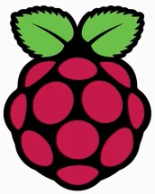

:toc:

= Coding Tutorials

[.float-group]
--

image::../img/apache-logo.webp[ApacheLogo,150,75,float="left"]

--

////

////

== Getting used to the Linux environment

* link:https://tarikgit.github.io/coding/asciidoctor.html[Using asciidoctor]: _asciidoctor is the text processor and publishing too that is used on this website to convert basic ascii text to HTML5_.

* link:https://tarikgit.github.io/coding/compiling.html[Compiling in different environments]: _I have been using LaTeX over the past two decades and it still remains my favorite typesetting system. In this link there are some scripts for using LaTeX together with Tikz and ghostscript_.

* link:https://tarikgit.github.io/coding/using-github.html[Using GitHub]: _This entire website is published using Github. Here are the commands that can be used to create a repository in Github and make changes to the same repository_.

* link:https://www.overleaf.com/learn/latex/Main_Page[Using Overleaf to compile LaTeX code]: _Overleaf is an online documentation system that uses LaTeX. There is no need to install anything on your computer. You can simply run your LaTeX scripts on the website_.

* link:https://tarikgit.github.io/coding/using-ssh.html[Using remote access in Linux]: _SSH is the Linux command that I rely on for accessing my local computers, servers and brickpi robots_.

* link:https://tarikgit.github.io/coding/using-raspberry-samba-apache.html[Using Raspberry Pi as a Samba and Apache server]: _I setup a Raspberry Pi as a local Samba and Apache server. Here is how I did it ..._

* link:https://sailfishos.org/wiki/Sailfish_OS_Cheat_Sheet#Package_Handling[Cheat sheet for Sailfish OS]: _My phone is running link:https://sailfishos.org/[Sailfish OS]. Although not free, it is an open-source operating system for my phone. You have full control over your phone, in the same way as a linux computer. Here is a cheat sheet for the basic commands_.

* link:https://tarikgit.github.io/coding/using-terminal-command.html[Using Terminal Command in Linux]

* link:using-gitlab.html[Using Gitlab]

* link:https://pimylifeup.com/raspberrypi-minidlna/[Setting Up *MiniDLNA* on the Raspberry Pi]

== Learning to code in Python ...

=== Python Tutorials

Here are useful ressources for teaching Python: 1. link:https://hourofcode.com/[Hour of Code],
2. link:https://python.infobrisson.fr/[Using Python without installation],
3. link:https://fr.vittascience.com/python[Learn to code using blocks and convert it into Python code]
4. link:https://www.python.org/[Install Python on your computer]
5. link:https://pyzo.org/[Free and open-source computing environment based on Python]
6. link:https://docs.python.org/3/library/turtle.html[Use the Turtle to learn and teach Python]
7. link:https://greenteapress.com/wp/think-python/[Think Python: Introduction to Python programming for beginners]
8. link:https://inforef.be/swi/python.htm[Apprentissage de la programmation: Ressources didactiques Gérard Swinnen]
9. link:https://www.pedagogie.ac-nantes.fr/mathematiques/enseignement/groupe-de-recherche/2017-2019/de-scratch-vers-python-1132341.kjsp?RH=1510509626265[Using Scratch knowledge of learners to teach Python  in class]
10. link:https://edupython.tuxfamily.org/[EduPython]
11. link:https://www.ac-clermont.fr/disciplines/fileadmin/user_upload/Mathematiques/pages/Telecharger/Une_demarche_pedagogique_pour_l_apprentissage_de_l_algorithmique.pdf[Teaching algorithms]
12. link:http://pythontutor.com/visualize.html#mode=edit[Online debugging tool that helps you to visualize your code]

* link:using-pygames.html[Learn to code through Pygames].

=== ... using MicroPython

* link:http://docs.micropython.org/en/latest/library/machine.html[MicroPython: the _machine_ library]

=== ... on a RaspberryPi

* The _MagPi_ link:https://magpi.raspberrypi.org/issues/[magazines] and link:https://magpi.raspberrypi.org/books[books]
are a valuable (but free) source to find inspiration for projects related to your link:https://www.raspberrypi.org/[Raspberry Pi].

* link:https://tarikgit.github.io/coding/using-sensehat.html[Using Sense HAT]: _The Sense HAT on the Raspberry Pi is an excellent tool for students to start scientific projects. Although it has been designed for the link:https://astro-pi.org/[Astro Pi] it can be used in so many other interesting projects_.

* link:https://tarikgit.github.io/coding/using-raspberry-pico[Using Raspberry Pi Pico]: _The link:https://www.raspberrypi.org/products/raspberry-pi-pico/[Raspberry Pi Pico] is a small, link:https://www.electronic-shop.lu/product/185605[cheap] and incredibly fast microcontroller board. The board is well-documented and extensions are cheap and simple to implement, as long as you have the link:https://www.electronic-shop.lu/search?q=kit[right kit] for your project_.

* link:https://pinout.xyz/[The Raspberry Pi GPIO pinout guide]

=== ... on a BBC micro:bit

* link:https://tarikgit.github.io/coding/using-microbit.html[Using BBC micro:bit]: _The BBC micro:bit is microcontroller board is link:https://www.electronic-shop.lu/product/164829[cheap] and has many build-in sensors and LED's. Using the PIO the board can be easily extended_. This microcontroller can be turned into a robot by using the link:https://www.electronic-shop.lu/product/166029[:Move mini] and then be controlled using a link:https://makecode.microbit.org/pkg/kitronikltd/pxt-kitronik-servo-lite[simple extension] to the MakeCode.

=== ... on a ESP32

TBC

=== Julia language

* link:https://julialang.org/[Julia] is another language similar to Python, but much faster. Here are some link:using-julia.html[ressources].

== Doing Maths on Raspberry Pi

* link:https://tarikgit.github.io/coding/using-mathematica-on-raspberry.html[Using Mathematica on a RaspberryPi]: _The Wolfram Language has been around for decades and it offers great tools. Now you can use the link:https://www.wolfram.com/raspberry-pi/[Wolfram language using Mathematica on your Raspberry] for free_.

== Teaching STEM through Coding

link:../teaching/makerspace2021-22.html[Resources for STEM and coding]

== Advanced Maths in a Linux environment

=== Dynamic Programming

* link:https://tarikgit.github.io/coding/computational-tools.html[Computational tools]: _Here are more advanced topics taken from dynamic programming (or optimal control theory), econometrics and statistics_

* link:https://tarikgit.github.io/coding/valueiteration-gridworld.html[Value iteration in the gridworld]: This page presents a simple example for value iteration in a 3-by-4 gridworld.

=== Optimization

* link:https://tarikgit.github.io/coding/neos-server/neos-server.html[A work-in-progess to model the decision-making of learners and teachers in the classroom.]

=== Great Tutorials From Others ...

* link:https://julia.quantecon.org/intro.html[QuantEcon]
* link:https://floswald.github.io/NumericalMethods/[Computational Economics for PhDs]
