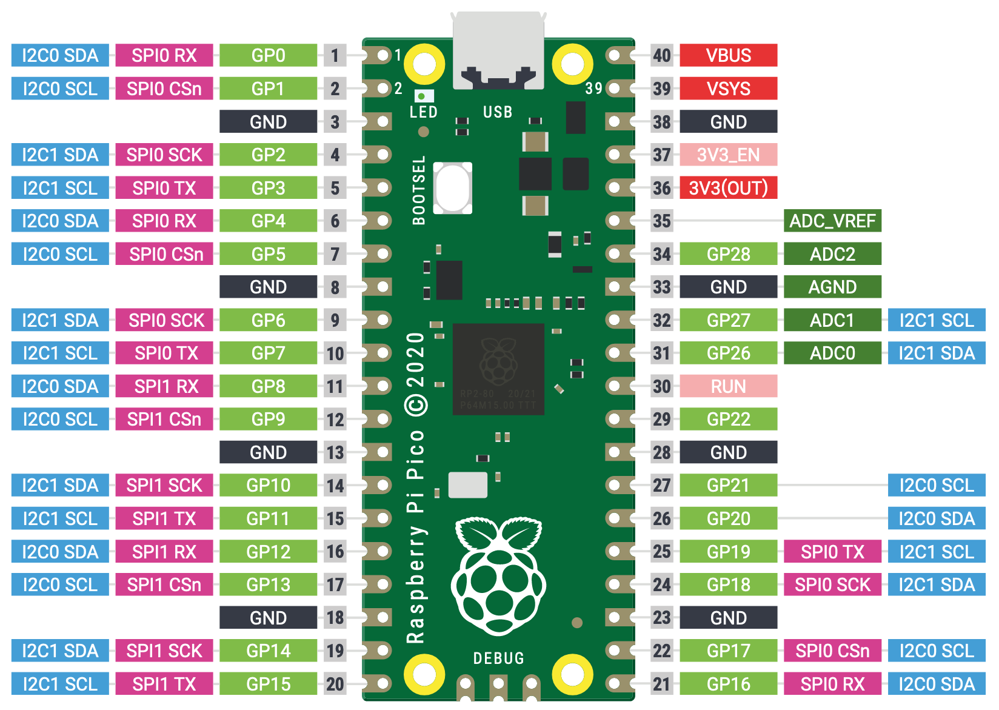
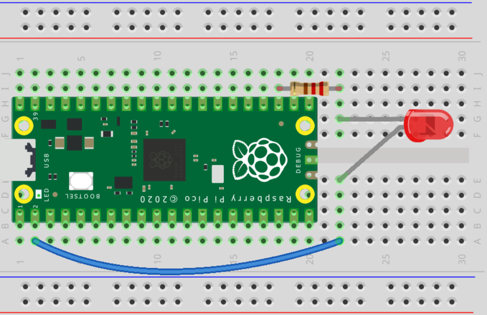
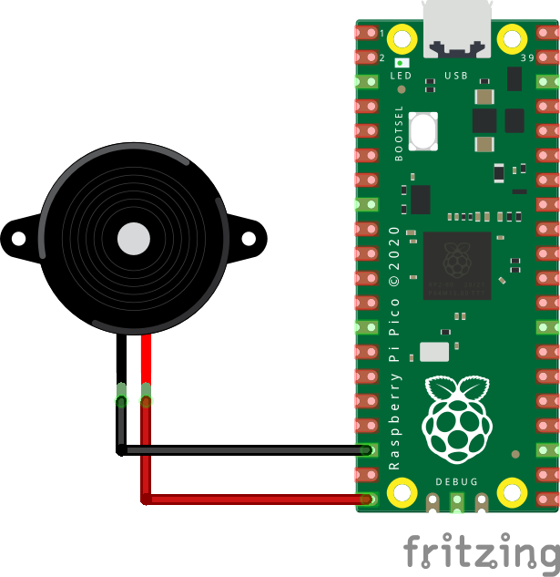

= Raspberry Pi Pico

Check the link:https://www.raspberrypi.org/documentation/rp2040/getting-started/#getting-started-with-micropython[_Getting Started_ page].

== Turn onboard LED on and off

[source,python]
----
import machine
import utime

led_pin = machine.Pin(25, machine.Pin.OUT)

while True:
    led_pin.value(1)
    utime.sleep(3)
    led_pin.value(0)
    utime.sleep(3)
----

== Read temperature from sensor

[source,python]
----
from machine import ADC
import utime

sensor_temp = ADC(4)
conversion_factor = 3.3 / 65535

while True:
    reading = sensor_temp.read_u16() * conversion_factor

    # The temperature sensor measures the Vbe voltage of a biased bipolar diode, connected to the fifth ADC channel
    # Typically, Vbe = 0.706V at 27 degrees C, with a slope of -1.721mV (0.001721) per degree.
    temperature = 27 - (reading - 0.706)/0.001721
    print(temperature)
    utime.sleep(2)
----

== Read Temperature and switch on LED if threshold is reached

[source,python]
----
from machine import ADC
import utime

sensor_temp = ADC(4)
conversion_factor = 3.3 / 65535

led_pin = machine.Pin(25, machine.Pin.OUT)

while True:
    reading = sensor_temp.read_u16() * conversion_factor

    # The temperature sensor measures the Vbe voltage of a biased bipolar diode, connected to the fifth ADC channel
    # Typically, Vbe = 0.706V at 27 degrees C, with a slope of -1.721mV (0.001721) per degree.
    temperature = 27 - (reading - 0.706)/0.001721
    print(temperature)
    utime.sleep(2)

    if temperature > 28:
        led_pin.value(1)
        utime.sleep(3)
    else:
        led_pin.value(0)
        utime.sleep(3)
----

== External LED on breadboard

[source,python]
----
import machine #library for hardware; allows us to access pins

import time #for delays

redLed = machine.Pin(1, machine.Pin.OUT) #initialize GPIO 1 as output for red LED

while (1): #infinite loop; runs until manually stopped

    redLed.toggle() #if LED is on, turn off. Else, turn on.

    time.sleep(.5) #pause for 1/2 second
----

== Data log of onboard temperature sensor

This code logs data collected from the onboard temperature sensor, and
the onboard led starts to blink as soon as the process has finished.

[source,python]
----
import machine
import utime

sensor_temp = machine.ADC(machine.ADC.CORE_TEMP)

conversion_factor = 3.3 / (65535)
file = open("temperature.txt", "w")

counter = 0

while counter < 10:
    reading = sensor_temp.read_u16() * conversion_factor
    temperature = 27 - (reading - 0.706)/0.001721
    file.write( str(temperature) + "\n" )
    file.flush()
    utime.sleep(30)

    print("Iteration no: ",counter)

    counter +=  1 # increment by one

print(" ")
print("Temperature log: ")
file = open("temperature.txt")
print(file.read())
file.close()

# Blink onboard led when data log is done
led_pin = machine.Pin(25, machine.Pin.OUT)

while True:
    led_pin.value(1)
    utime.sleep(1)
    led_pin.value(0)
    utime.sleep(1)

----

== Adding sound to your Pico

----
from machine import Pin, PWM
from utime import sleep

buzzer = PWM(Pin(15))

buzzer.freq(500)
buzzer.duty_u16(1000)
sleep(1)
buzzer.duty_u16(0)
----

== Playing a tune on your Pico

[source,python]
----
from machine import Pin, PWM
from utime import sleep
buzzer = PWM(Pin(15))

tones = {
"B0": 31,
"C1": 33,
"CS1": 35,
"D1": 37,
"DS1": 39,
"E1": 41,
"F1": 44,
"FS1": 46,
"G1": 49,
"GS1": 52,
"A1": 55,
"AS1": 58,
"B1": 62,
"C2": 65,
"CS2": 69,
"D2": 73,
"DS2": 78,
"E2": 82,
"F2": 87,
"FS2": 93,
"G2": 98,
"GS2": 104,
"A2": 110,
"AS2": 117,
"B2": 123,
"C3": 131,
"CS3": 139,
"D3": 147,
"DS3": 156,
"E3": 165,
"F3": 175,
"FS3": 185,
"G3": 196,
"GS3": 208,
"A3": 220,
"AS3": 233,
"B3": 247,
"C4": 262,
"CS4": 277,
"D4": 294,
"DS4": 311,
"E4": 330,
"F4": 349,
"FS4": 370,
"G4": 392,
"GS4": 415,
"A4": 440,
"AS4": 466,
"B4": 494,
"C5": 523,
"CS5": 554,
"D5": 587,
"DS5": 622,
"E5": 659,
"F5": 698,
"FS5": 740,
"G5": 784,
"GS5": 831,
"A5": 880,
"AS5": 932,
"B5": 988,
"C6": 1047,
"CS6": 1109,
"D6": 1175,
"DS6": 1245,
"E6": 1319,
"F6": 1397,
"FS6": 1480,
"G6": 1568,
"GS6": 1661,
"A6": 1760,
"AS6": 1865,
"B6": 1976,
"C7": 2093,
"CS7": 2217,
"D7": 2349,
"DS7": 2489,
"E7": 2637,
"F7": 2794,
"FS7": 2960,
"G7": 3136,
"GS7": 3322,
"A7": 3520,
"AS7": 3729,
"B7": 3951,
"C8": 4186,
"CS8": 4435,
"D8": 4699,
"DS8": 4978
}

song = ["E5","G5","A5","P","E5","G5","B5","A5","P","E5","G5","A5","P","G5","E5"]

def playtone(frequency):
    buzzer.duty_u16(1000)
    buzzer.freq(frequency)

def bequiet():
    buzzer.duty_u16(0)

def playsong(mysong):
    for i in range(len(mysong)):
        if (mysong[i] == "P"):
            bequiet()
        else:
            playtone(tones[mysong[i]])
        sleep(0.3)
    bequiet()
playsong(song)

----

== Sources

* https://www.youtube.com/watch?v=L03jT5slWnw
* https://www.theelectronics.co.in/2021/02/read-temperature-sensor-of-pico.html
* https://community.microcenter.com/discussion/7038/using-the-raspberry-pi-pico
* https://electronoobs.com/eng_arduino_tut135.php
* https://electronoobs.com/eng_arduino_tut138.php
* https://www.youtube.com/watch?v=dlAhGopKGpI
* https://www.tomshardware.com/how-to/buzzer-music-raspberry-pi-pico
