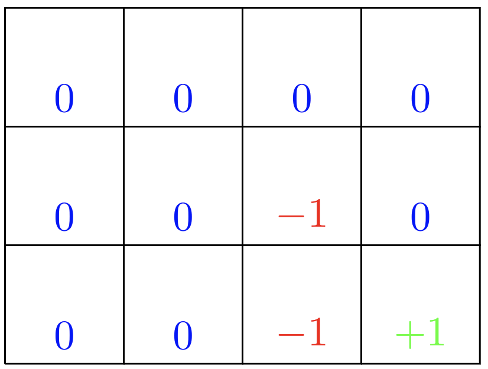
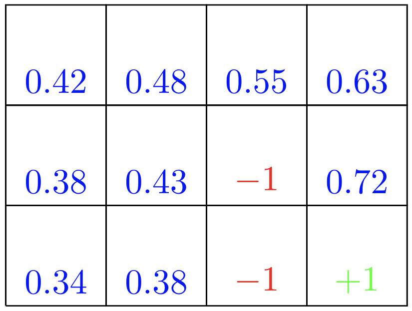
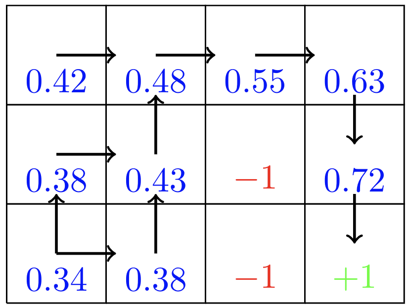

= Value Iteration - Gridworld
:stem:

We consider a rectangular gridworld representation (see below) of a simple finite Markov Decision Process (MDP).
The cells of the grid correspond to the states of the environment.
At each cell, four actions are possible: north, south, east, and west, which
deterministically cause the agent to move one cell in the respective direction
on the grid. Actions that would take the agent off the grid leave its location
unchanged, but also result in a reward of -1. In other words, rewards are positive
for goals, negative for running into undesirable states, and zero the rest of the time.

Next we define the rewards for the states. Those will be of +1 for the state
that is desirable, of -1 for states that have to be avoided and of 0 for all
other states.

The Bellman equation (see below) must hold for each state for the value function
stem:[v_{pi}].

stem:[ v_{pi}(s) = \sum_a \pi(a|s) \sum_{s'|r} p(s',r|s,a)  [ r + \gamma v_{\pi}(s') ]  ]
, for all stem:[s \in S]

where the actions, stem:[a], are taken from the set stem:[A(s)], that the next
states, stem:[s'], are taken from the set stem:[S], and that the rewards,
stem:[r], are taken from the set stem:[R].

The Bellman equation expresses a relationship between the value of a state
and the values of its successor states.

Suppose the agent selects all four actions with equal probability in all states.
The figure below shows the value function, stem:[v_{pi}], for this policy, for the
discounted reward case with stem:[\gamma = 0.9].

This value function was computed by solving the system of linear equations in
the expression for the Bellman equation above.

== Source code

[source,python]
----

import numpy as np

'''==================================================
Initial set up
=================================================='''

#Hyperparameters
SMALL_ENOUGH = 0.005
GAMMA = 0.9
NOISE = 0.1

#Define all states
all_states=[]
for i in range(3):
    for j in range(4):
            all_states.append((i,j))

#Define rewards for all states
rewards = {}
for i in all_states:
    if i == (1,2):
        rewards[i] = -1
    elif i == (2,2):
        rewards[i] = -1
    elif i == (2,3):
        rewards[i] = 1
    else:
        rewards[i] = 0

#Dictionnary of possible actions. We have two "end" states (1,2 and 2,2)
actions = {
    (0,0):('D', 'R'),
    (0,1):('D', 'R', 'L'),
    (0,2):('D', 'L', 'R'),
    (0,3):('D', 'L'),
    (1,0):('D', 'U', 'R'),
    (1,1):('D', 'R', 'L', 'U'),
    (1,3):('D', 'L', 'U'),
    (2,0):('U', 'R'),
    (2,1):('U', 'L', 'R'),
    }

#Define an initial policy
policy={}
for s in actions.keys():
    policy[s] = np.random.choice(actions[s])

#Define initial value function
V={}
for s in all_states:
    if s in actions.keys():
        V[s] = 0
    if s ==(2,2):
        V[s]=-1
    if s == (1,2):
        V[s]=-1
    if s == (2,3):
        V[s]=1

'''==================================================
Value Iteration
=================================================='''

iteration = 0
while True:
    biggest_change = 0
    for s in all_states:
        if s in policy:

            old_v = V[s]
            new_v = 0

            for a in actions[s]:
                if a == 'U':
                    nxt = [s[0]-1, s[1]]
                if a == 'D':
                    nxt = [s[0]+1, s[1]]
                if a == 'L':
                    nxt = [s[0], s[1]-1]
                if a == 'R':
                    nxt = [s[0], s[1]+1]

                #Choose a new random action to do (transition probability)
                random_1=np.random.choice([i for i in actions[s] if i != a])
                if random_1 == 'U':
                    act = [s[0]-1, s[1]]
                if random_1 == 'D':
                    act = [s[0]+1, s[1]]
                if random_1 == 'L':
                    act = [s[0], s[1]-1]
                if random_1 == 'R':
                    act = [s[0], s[1]+1]

                #Calculate the value
                nxt = tuple(nxt)
                act = tuple(act)
                v = rewards[s] + (GAMMA * ((1-NOISE)* V[nxt] + (NOISE * V[act])))
                if v > new_v: #Is this the best action so far? If so, keep it
                    new_v = v
                    policy[s] = a

       #Save the best of all actions for the state
            V[s] = new_v
            biggest_change = max(biggest_change, np.abs(old_v - V[s]))

   #See if the loop should stop now
    if biggest_change < SMALL_ENOUGH:
        break
    iteration += 1

----

== Sources:

* link:dynamicprogramming/vfi-robot.py[Source code]
* link:../latex/main-vfi-gridworld.tex[LaTeX source code for the graphics]
* Sutton and Barto. Reinforcement Learning
* link:https://towardsdatascience.com/how-to-code-the-value-iteration-algorithm-for-reinforcement-learning-8fb806e117d1[How To Code The Value Iteration Algorithm For Reinforcement Learning]
