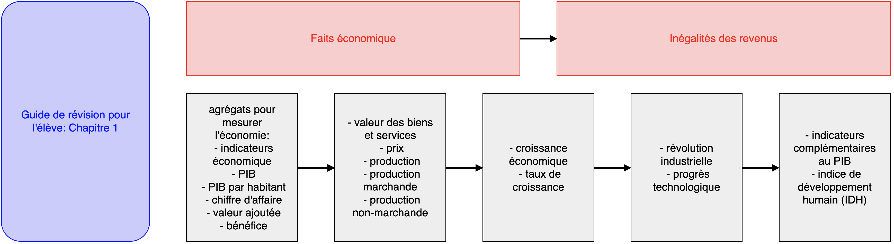

= Introduction aux sciences économiques

== Chapitre 1: L’activité économique et niveau de vie

. Cours
.. Introduction
.. Le produit intérieur brut
.. La révolution technologique
.. Conclusion
. Cahier d'exercice
. Guide de révision pour l'élève

////

== Chapitre 2:
. Cours
.. Propriété privée, marchés et entreprises
.. La croissance économique
.. Les sciences économiques et l'économie
. Cahier d'exercice
. Guide de révision pour l'élève

////
