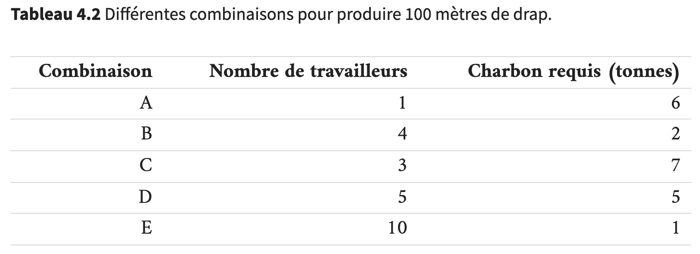

////
Run the following command:
asciidoctor -r asciidoctor-question sample.adoc
////

= Questions: Contrôle des connaissances

Choisissez la bonne réponse:

== Question 4.1 (Econofides STMG)

Le Tableau 4.2 montre différentes combinaisons produisant 100 mètres de drap.

[question, mc]
....
Que pouvons-nous conclure du graphique?

- [ ] La combinaison D est plus intensive en énergie que la combinaison C.
- [x] La combinaison B domine la combinaison D.
- [ ] La combinaison A est celle qui minimise les coûts pour tous les prix du charbon et tous les salaires.
- [ ] La combinaison C peut parfois être moins coûteuse que A.
....
