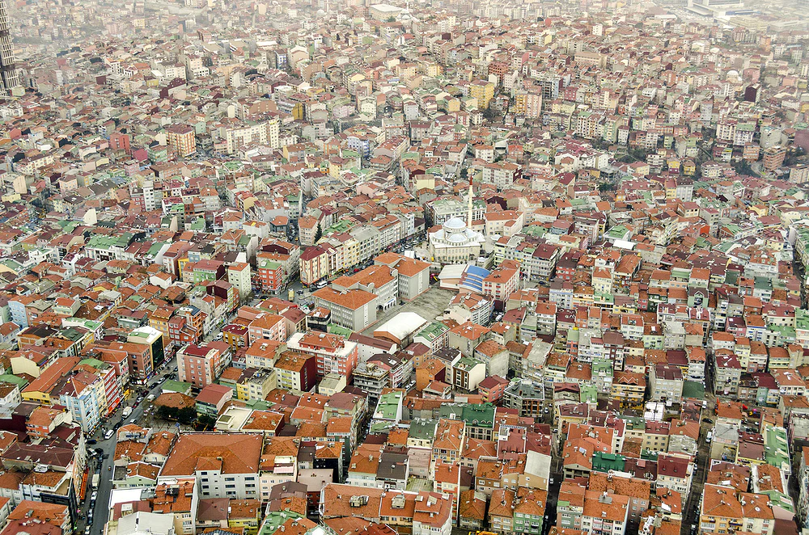

= Images in asciidoctor

link:https://developers.google.com/speed/webp[The webp format].

link:01-tree.svg[Tree]

.svg (6.1M)
image::01-tree.svg[Tree,200,100]

.webp (386K)

.png (1.6M)

.svg (609K)

