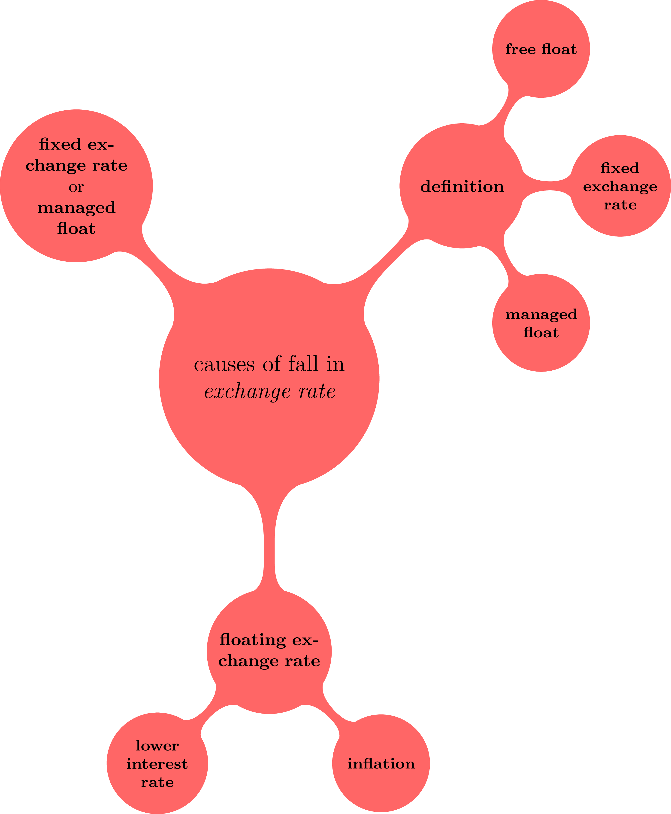
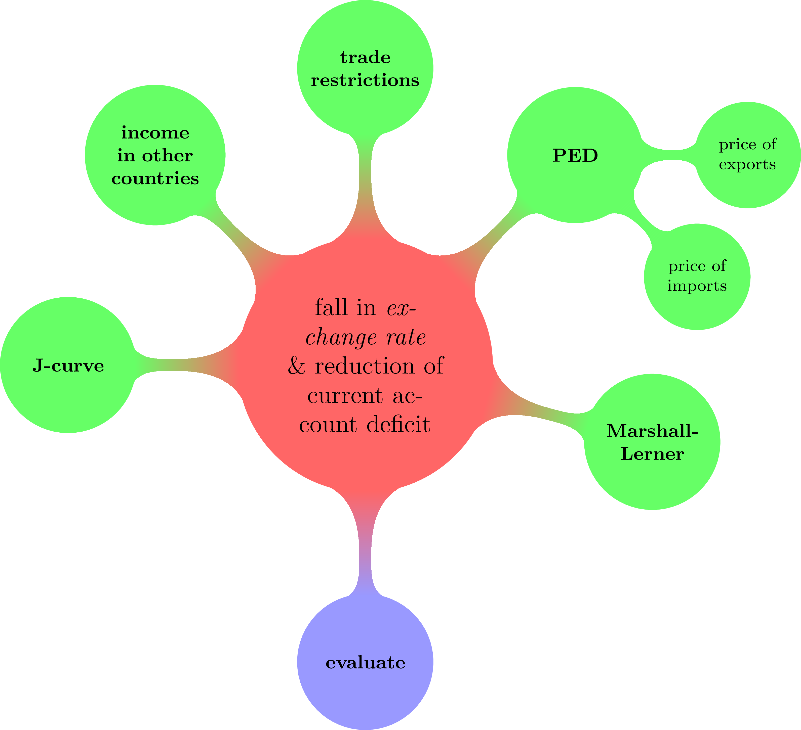
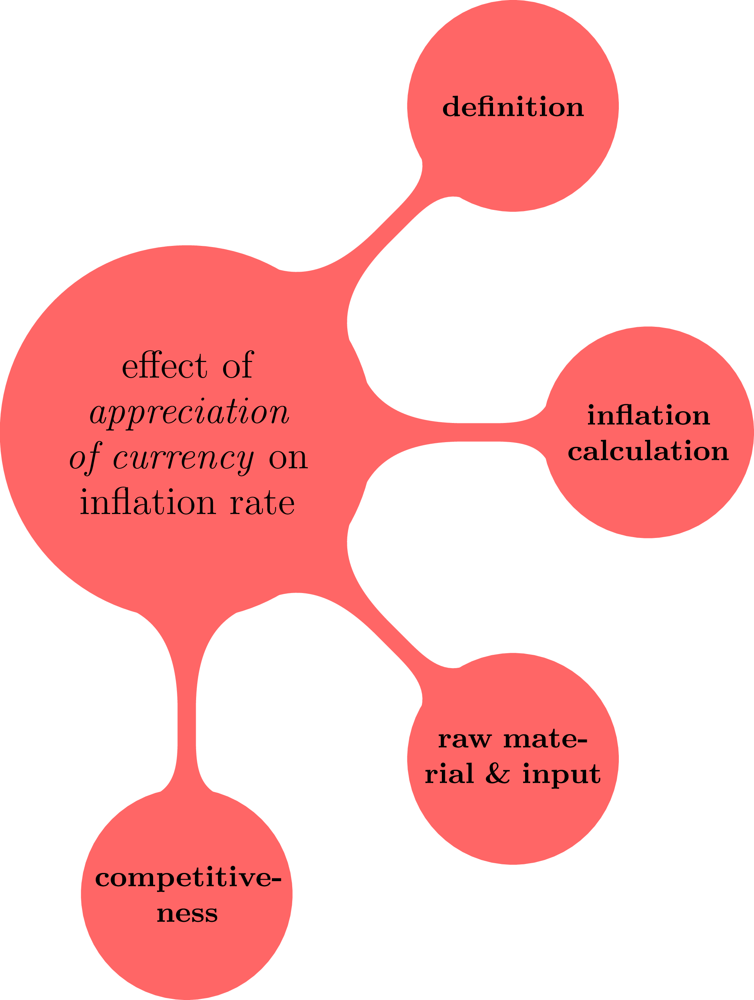
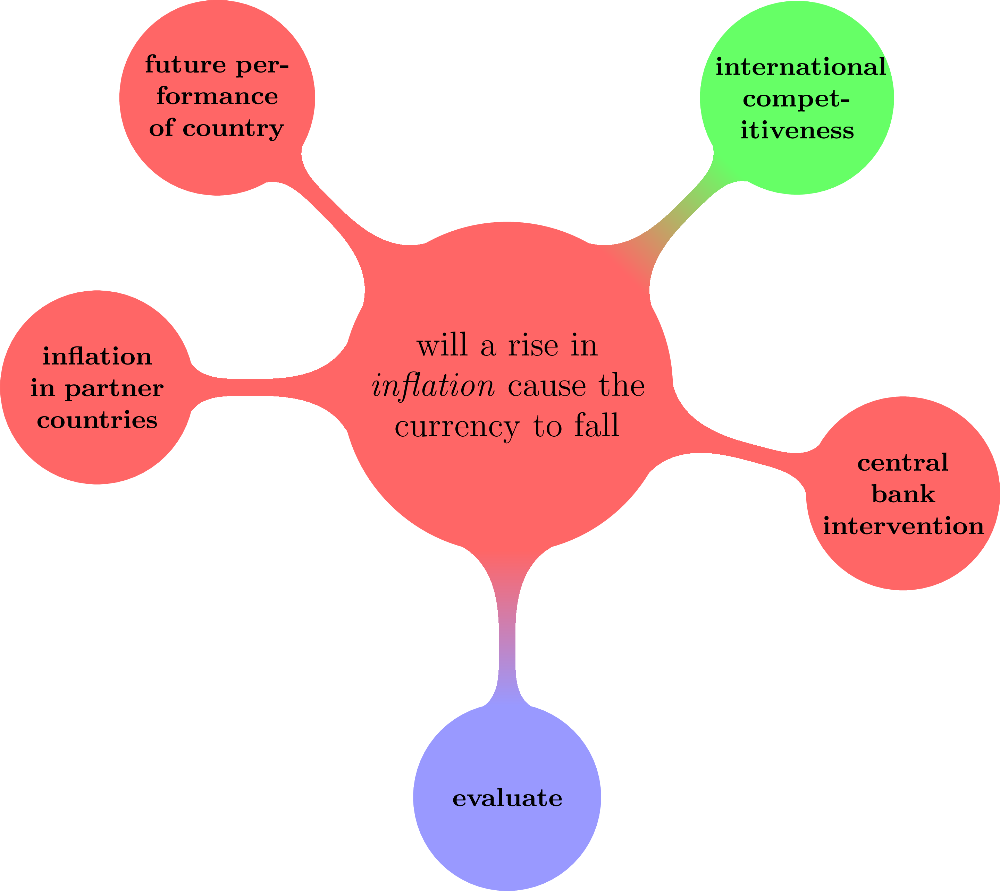

= Economics essay writing

== Exam-style question (10/3/2020)          

The questions are taken from page 78 in your revision guide.

* Explain the causes of a fall in a country's exchange rate (8 marks). +
* Discuss whether a fall in a country's exchange rate will reduce a deficit on the current account of the balance of payments of the country (12 marks).

[.float-group]
--
[.left]
.8-mark question 

[.right]
.12-mark question

--

{blank} +

* Explain the effects of an appreciation of its currency on an economy's inflation rate (8 marks).
* Discuss whether a rise in an economy's inflation rate will cause the value of its currency to fall (12 marks).

[.float-group]
--
[.left]
.8-mark question 

[.right]
.12-mark question

--

{blank} +

                             
[ditaa, ../img/ditaa-essaywriting]
....

 +------------------------+                            +-------------------------------+
 |                        |                            |                               |
 |      Argument:         |                            |   Counterbalance argument:    |
 |       {d}              |<-----+                +--->|               {d}             |
 +------------------------+      |                |    +-------------------------------+  
                                 |                |
                                 |                |
                                 |                |
                             /------------------------\
                             |                        |
                             |      Key term          |
                             |                        |
                             \------------------------/  
                                         |
                                         | 
                                         |
                                         v
                             +------------------------+
                             |                        |
                             |      Evaluation        |
                             |          {d}           |
                             +------------------------+  

....

The following chart represents the essay from the revision guide (page 176).

[ditaa, ../img/ditaa-essaywriting-example1]
....

 +------------------------+                            +-------------------------------+
 |                        |                            |                               |
 |                        |                            |                               |
 |       {d}              |<-----+                +--->|               {d}             |
 |                        |      |                |    |                               |
 |  market economy        |      |                |    |    planned economy            |
 |                        |      |                |    |                               |
 |   market forces        |      |                |    |     distribution of income    |
 |   resource allocation  |      |                |    |     state planning            |
 |   price mechanism      |      |                |    |     merit/demerit goods       |
 |   scarce resources     |      |                |    |                               |
 |        more expensive  |      |                |    |                               |
 |                        |      |                |    |                               |
 |   advantages of price  |      |                |    |    advantages of planned      |
 |        mechanism (...) |      |                |    |               economy (...)   |
 |   downsides of price   |      |                |    |    downsides of planned       |
 |        mechanism (...) |      |                |    |               economy (...)   |
 |                        |      |                |    |                               |
 |                        |      |                |    |                               |
 |                        |      |                |    |                               |
 |                        |      |                |    |                               |
 |                        |      |                |    |                               |
 +------------------------+      |                |    +-------------------------------+  
                                 |                |  
                                 |                | 
                                 |                |  
                                 |                |  
                                 |                |
                                 |                |
                                 |                |
                             /------------------------\
                             |                        |
                             |  the economic problem  |
                             |                        |
                             \------------------------/  
                                         |
                                         | 
                                         |
                                         v
                             +------------------------+
                             |                        |
                             |      Evaluation        |
                             |          {d}           |
                             +------------------------+  

....

