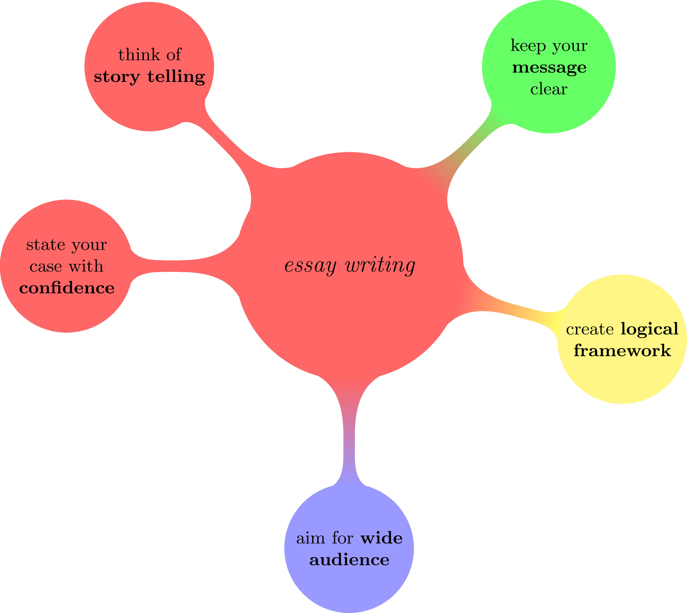

= How to write a good essay

The following text is inspired by link:https://www-nature-com.proxy.bnl.lu/articles/d41586-018-02404-4[Gewin, Virginia. "How to write a first-class paper." Nature 555.7694 (2018)]. I made small adaptations for AS/A level Business and Economics essay-writing.

== Keep your message clear

* Before starting to write, think about _the message_ that you want to give to the reader: a clear message avoids misinterpretations
* Decide (before writing) about:
** the _main message_
** selection of data (from the extract)
** visual presentation (e.g. diagrams, ...)
* the most important information should be in the main text/paragraph
* avoid speculation; instead use evidence-based conclusions (this includes _scenario-building_)
* conclusions should include a _personal expert statement_

== Create logical framework

* In each paragraph:
** the first sentence defines the _context_
** the body contains the _new idea_
** the final sentence offers a _conclusion_
* The _introduction_ sets the context (optional in short essays)
* The _main body_ of your essay is composed of _balanced arguments_
* The _conclusion_ contains the evaluation (e.g. judgement, advice, ...)
* Guide the reader to the points where you want to give your judgement and advice
* Focus on the _straight line_ that your audience follows from the introduction to the conclusion

== State your case with confidence

* AS/A level students are often scared to make confident statements, especially in the conclusion/evaluation
* Economics and Business essays depend a lot on a _strong confident writing_ 
* As long as it is evidence-based, you should not hesitate to state your position with confidence

== Think of story telling

* Always think of your _busy, tired reader_ when you write your essay
* Deliver a paper that you would enjoy reading yourself

== Aim for a wide audience

* Write in a way that is accessible to _non-specialists_
* Use terminology, but if it is very specific to your subject, define it to your reader