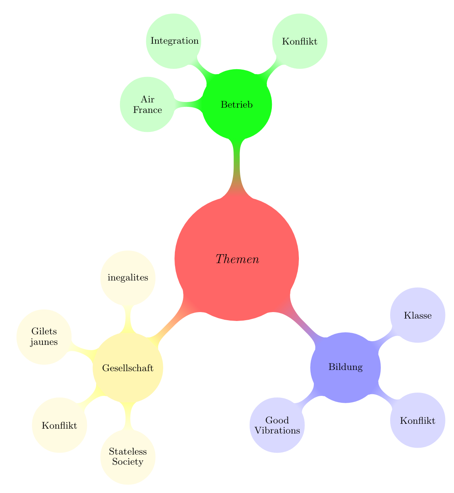

= Soziologie

== Erklärvideos

link:https://www.youtube.com/watch?v=wMZwR6HEN9g[Max Weber: Einführung in seine Soziologie (Rationalität/Irrationalität, soziales Handeln)] +
link:https://www.youtube.com/watch?v=8gkSkkb6_-I[Emile Durkheim: Einführung in seine Soziologie (soziale Solidarität)]

== Zusätzliche Ressourcen

=== Zahlen & Statistiken

link:https://statistiques.public.lu/[Statec]

=== Zeitungen

link:https://www.faz.net[Frankfurter Allgemeine Zeitung]

=== Bundeszentrale für politische Bildung

link:https://www.bpb.de/[BPB]

=== Reportagen

Arte, 3Sat, Educ'Arte

. link:https://www.alternatives-economiques.fr/podcast/le-dialogue-social-nest-il-quune-histoire-de-ceinture-et-de-chemise-201510271107-00002413.html[Le dialogue social n’est-il qu’une histoire de ceinture et de chemise? (Alternatives Economiques)]

== Dans ton tel ...

Huit adolescents nous ouvrent leur téléphone portable et se racontent
à travers cet objet de l’intime et les usages qu’ils en font.
Féministe, écologiste, curieux et engagés, autant de portraits à
l’ère des réseaux sociaux.

=== Meryem: _identité_

Entre comptes féministes et partages de citations qui l'inspirent,
Meryem cherche à mieux se comprendre et à se faire entendre.

Déconstruire, construire et reconstruire son identité féminine.
L'usage du téléphone de Meryem est double : récit intime et récit de l'intime.

link:https://educ.arte.tv/program/dans-ton-tel-meryem[Un film de Sheerazad Chekaik-Chaila et Antoine Schirer (2019, 5min)]

*Mots clés*:  _vie quotidienne - égalité - télécommunications - réseau social (Internet) - médias de masse - nouveaux médias - nature et vie - corps et santé - conscience du corps - identité - trouver son identité - société des médias - comportement face aux médias - utilisation d’appareils mobiles - sentiment - radiotechnique - téléphone - identité culturelle - réseaux sociaux - usage des médias_

=== Eloïse: _identité_

Sensible à l'éthique animale et environnementale, Eloïse s'entraîne à un
comportement écologiste.

Même si parfois, Eloïse doit s'éloigner de son éducation, elle apprend aussi
en passant par des modes de consommation responsables.

link:https://educ.arte.tv/program/dans-ton-tel-eloise[Un film de Sheerazad Chekaik-Chaila et Antoine Schirer (2019, 4min)]

*Mots clés*:  _nutrition / alimentation - vie quotidienne - conscience - dégradation de l’environnement - empreinte écologique - télécommunications - réseau social (Internet) - médias de masse - nouveaux médias - déchets - ramassage des ordures - valorisation des déchets - recyclage - identité - société des médias - comportement face aux médias - utilisation d’appareils mobiles - radiotechnique - téléphone - identité culturelle - réseaux sociaux - usage des médias_

=== Yannis: _usage des médias_

A l'époque des textos et autres émojis, Yannis, lui, utilise son téléphone
pour le plaisir de la littérature.

Yannis y rédige des récits imaginés, apprend ses pièces de théâtre et
enregistre ses livres favoris. Comme Spinoza.

link:https://educ.arte.tv/program/dans-ton-tel-yannis[Un film de Sheerazad Chekaik-Chaila et Antoine Schirer (2019, 4min)]

*Mots clés*:  _lecture (pour adolescents) - littérature - théâtre - temps et changement - temps et rythmique - notions de temps - écrivains, etc. - Stendhal - télécommunications - réseau social (Internet) - médias de masse - nouveaux médias - faire face à la vie - gestion du temps - écriture - vie quotidienne - mémoire - apprentissage - lecture d’auteur - société des médias - comportement face aux médias - utilisation d’appareils mobiles - radiotechnique - téléphone - réseaux sociaux - usage des médias_

=== Hamza: _usage des médias_

Curieux, Hamza préfère apprendre sur Internet plutôt qu'assis dans une
salle de classe.

Droit, philosophie, économie, musculation... Des Youtubeurs le guident
en façonnant aussi bien son esprit que son corps.

link:https://educ.arte.tv/program/dans-ton-tel-hamza[Un film de Sheerazad Chekaik-Chaila et Antoine Schirer (2019, 5min)]

*Mots clés*:  _langue française - cours de langue (français) - politique - loi - éthique - philosophie - télécommunications - réseau social (Internet) - méthodologie en sport - médias de masse - nouveaux médias - vie quotidienne - mémoire - apprentissage - société des médias - comportement face aux médias - utilisation d’appareils mobiles - droit - réseaux sociaux - usage des médias - motivation_

=== Tâches pour les élèves:

. Regarder la vidéo en vous concentrant sur le mot clé qui se trouve derrière le nom
. Préparez une présentation sur le sujet en utilisant le contenu de la vidéo comme illustration

Les groupes:

. _Meryem_: Hugo, Helena; Jasmin, Camille
. _Eloïse_: Pit, Sally
. _Yannis_: Loris, Lenn
. _Hamza_: Dwayn, Samir

=== Définition:

. *Identité*: +
L'«identité» recouvre cinq sens ou nuances de sens : ils expriment la
similitude, l’unité, l’identité personnelle, l’identité culturelle et
la propension à l’identification

. *Rôle/usage des médias* +

