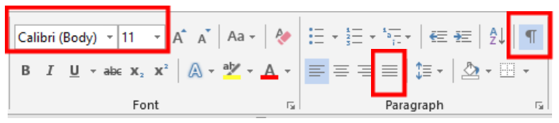
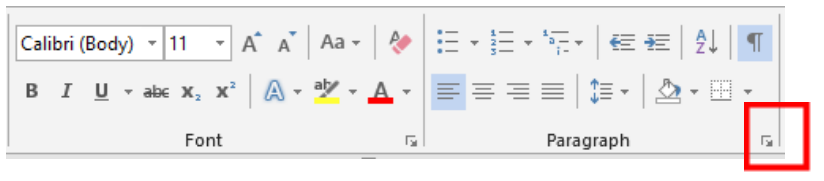
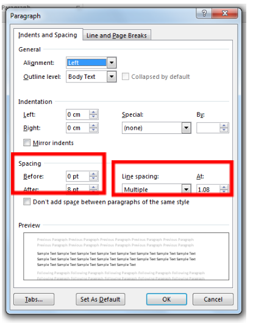
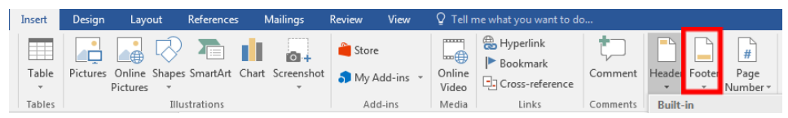
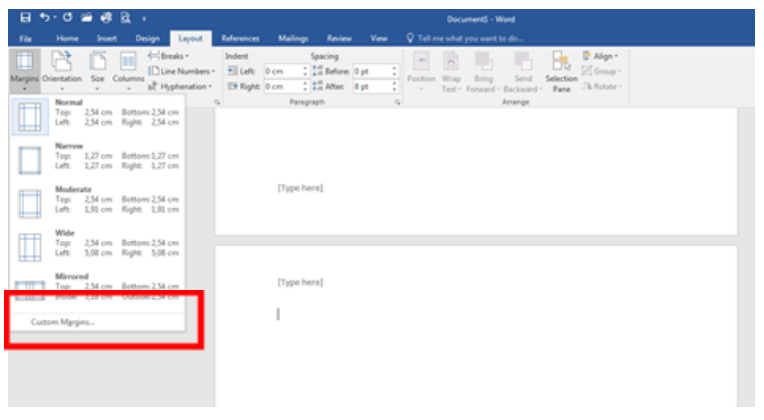

= Configuration de base

== Home

. *Cursor* :toujours « cliqué » 
. *Police d’écriture*: choisir Arial  
. *Taille d’écriture*: 12  
. *Lignes*: justifié 

== Home/Paragraph

. *Spacing Before et After*: 0 
. *Line spacing*: Single 

== Insert

. *Footer*: choisir le master prédéfini en classe 
. *Nom*: MUSTERMANN Max / T0CM 
. *Date* : Date, heures / minutes / secondes 

(éventuellement à utiliser : Design) 

== Page layout

. *Margins* (Top, Left, Bottom, Right): 2 cm 

== Review

. *Language*: Globus A  
. *Set proofing language*: Do not check spelling 

== View

. *Ruler*:toujours « cliqué » 

== Print

. Ctrl + P ou via file 