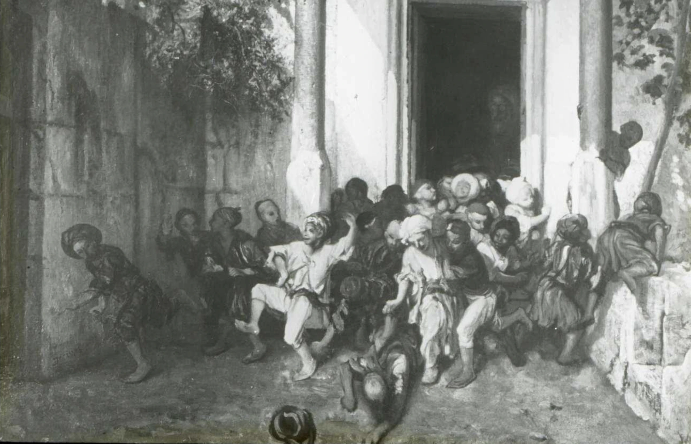

= Teaching and Learning Methods

. *Comment prendre des notes?* (voici link:taking-notes.html[quelques exemples]; 7/9/2021)
. *Technology Entrepreneurship* (link:../posters/04_Technology_Entrepreneurship_Education.pdf[poster]): This poster gives an overview of a first attempt to confront young learners with _entrepreneurship_ and technology through the link:https://www.makerspace.lu/[_makerspace_]. Relevant tutorials and other sources can be found in this link:https://docs.google.com/spreadsheets/d/1EYiVXnArmv5ou1BTaaZGYh9QgV_grjzNWdl6x1dn64w/edit?usp=sharing[database]. (6/9/2021)
. *Club de Midi: Kickstart a Business* (link:../teaching/cdm-kickstart-a-business/CdM-Kickstart-a-Business-Poster.jpg[poster]): This poster is used to promote a workshop that combines _entrepreneurship_ with the Makerspace for middle school learners. (20/9/2021)
. *Open Source Media Content For Teaching Economics* (link:../posters/01_Poster_IFEN_Landscape.pdf[poster]): _This link:https://drive.google.com/file/d/1G6oxgboywzi4rEmuShdcNWmS6MlX__Vf/view?usp=sharing[media database] collects all the material that I am using in class as a support for teaching._ (20/2/2021)
. *A-Level Economics Teaching Approach* (link:../posters/01_Poster_A_level.pdf[poster]): _This poster provides an overview of the teaching approach for the international A level system._ (6/3/2021)
. *Enseignement secondaire général - Division administrative et commerciale* (link:../posters/03_Poster_Departement_Sciences_Economiques_ESG.pdf[poster]): _This poster provides an overview of the secondary school system in Luxembourg with focus on the trade specialisation. These are learners who are on average aged between 14 and 18._ (1/4/2021)
. *Technicien en Administration et Commerce* (link:../posters/03_Poster_Departement_Sciences_Economiques_TPCM.pdf[poster]): _This poster provides an overview of the vocational schooling system in Luxembourg with focus on the trade specialisation. These are learners who are on average aged between 14 and 18._ (1/4/2021)
. *Etudier les sciences économiques* (link:../posters/03-EconomieExpliquee.pdf[slides]): _Here are some slides that I use to explain to younger learners what studying economics, trade and business is about._ (14/3/2021)

////

////
