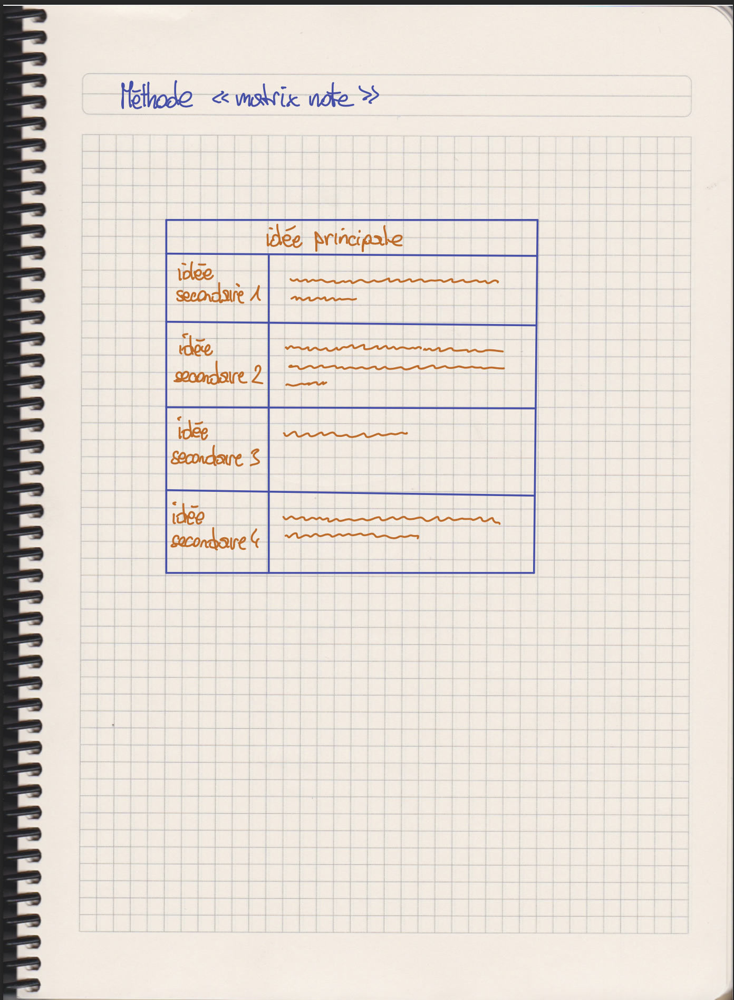
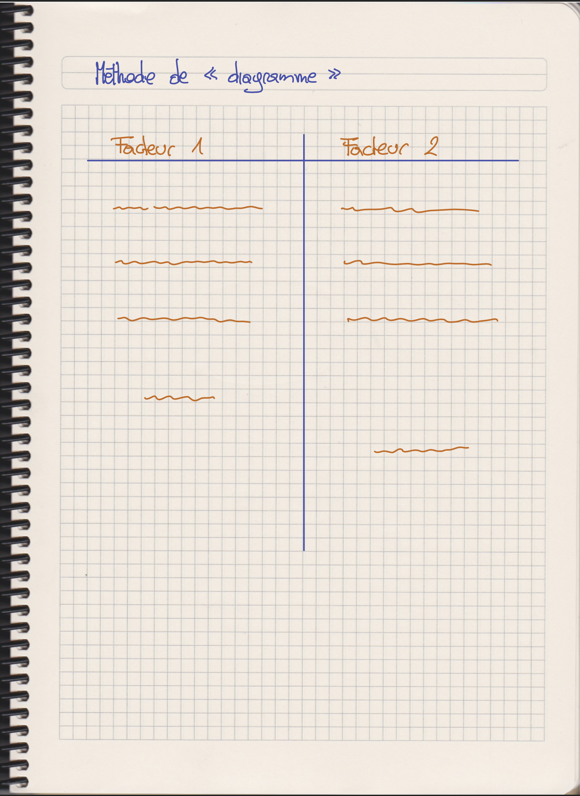
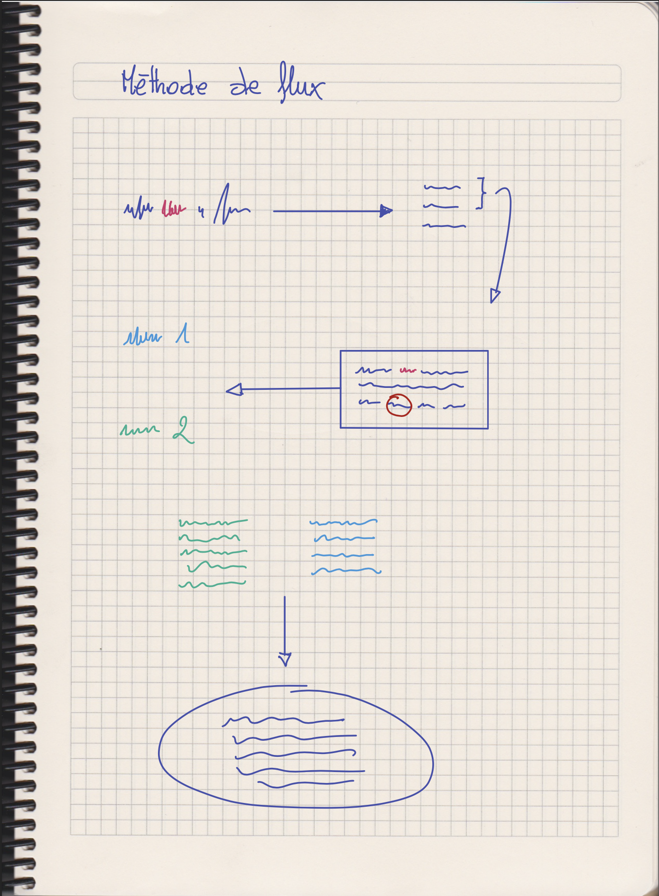
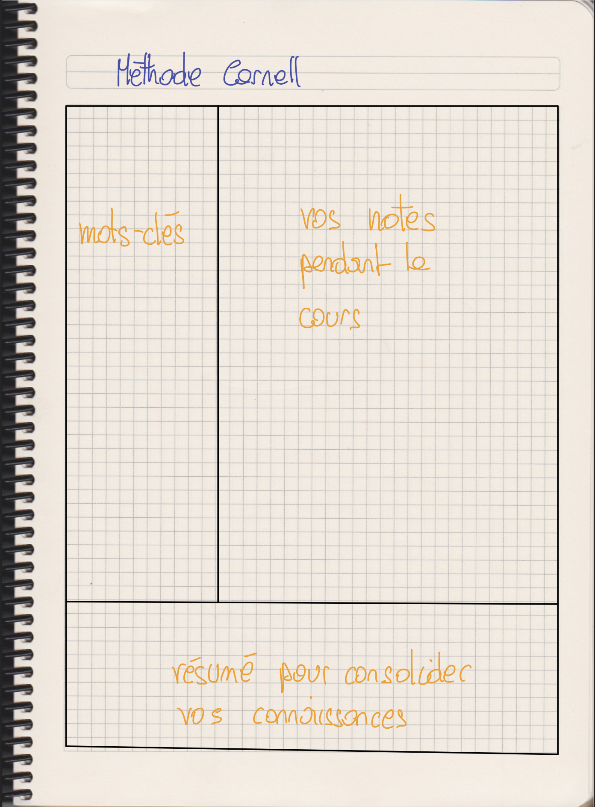
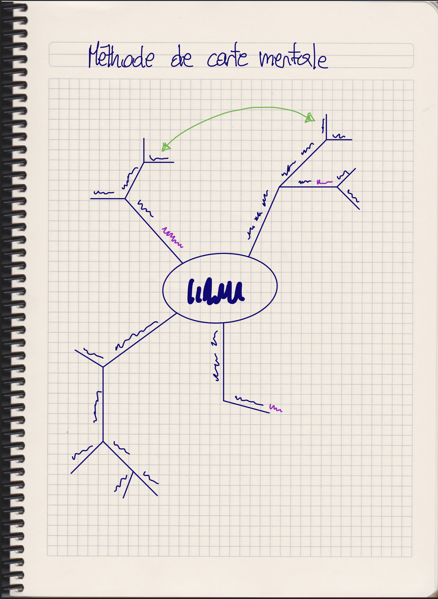

= Comment prendre des notes?

Le processus de rédaction et de révision de vos notes de cours vous aide à
vous *souvenir des informations*. Prendre des notes au fur et à mesure, vous
facilitera la tâche lorsque vous réviserez plus tard dans l'année.

Il faut noter que la prise de notes est une *compétence complexe*. Elle
nécessite que les apprenant(e)s prenant des notes doivent effectuer simultanément
plusieurs opérations:

. écouter
. comprendre les informations entendues
. sélectionner les informations pertinentes
. transcrire ces informations eout en les hiérarchisant
. marquer les liens entre les informations
. noter les informations rapidement (utiliser des abbréviations et symboles)

Il existe différentes techniques pour prendre des notes:

== La méthode _libre_

Écrire d'une manière libre ce que qui est discuté en classe.

== Écrire directement _sur les documents_ distribués en classe

Écrire les notes directement dans les documents contenant les informations
importantes (p.ex. les copies distribuées au début du cours).

== La méthode _matrix note_

Les idées et sous-idées sont fournies dans un tableau par l'enseignant.
Les notes peuvent aussi contenir les questions venant des apprenants, ou
encore les exemples discutés en classe. Ainsi les points importants des échanges
entre les apprenants et les enseignants peuvent aussi être noté dans le
tableau.

== La méthode de _diagramme_

Faire un graphique avec une colonne différente pour chaque facteur ou approche
discuté en classe. Ensuite, écrire les détails dans chaque colonne, afin de
pouvoir comparer les éléments entre colonnes.

== Méthode de _flux_

Apprenez en écoutant. Créez votre propre représentation des nouvelles
informations.

. Mettez ce que vous entendez dans vos propres mots
. Utilisez des dessins rapides pour décomposer le contenu en idées simples
. Utilisez des flèches pour lier les idées entre elles et ajouter des points supplémentaires
. Encerclez ou encadrez différents points en utilisant différentes lignes, formes ou stylos de couleur.

== Méthode _Cornell_

Divisez votre page en trois parties:

. Utilisez la section « notes » pour prendre des notes pendant la leçon.
. Après la leçon, révisez vos notes. Réduisez les sections des notes en mots-clés et écrivez-les dans la colonne « mots-clés ».
. Rédigez un résumé pour consolider ce que vous avez appris.

== Méthode de la _carte mentale_

Écrivez le sujet de la leçon au centre de votre page.

. Ajoutez une nouvelle branche pour chaque nouveau sous-sujet.
. Ajoutez des branches de plus en plus petites pour plus de détails ; ceux-ci montrent les liens entre des faits ou des idées.
. Ajoutez des notes à l'aide de mots et de diagrammes ; utilisez les flèches pour afficher les liens.
. Gardez vos notes courtes et mettez des mots clés le long des branches.
. Utilisez des stylos de couleur et des surligneurs pour souligner les points clés.

== Méthode par _bullet points_

Utiliser des bullet points

. Les puces (= bullet point) de haut niveau sont les points clés de la leçon.
. Les puces de sous-niveau sont des détails sur les points de niveau supérieur.
. Les puces de sous-sous-niveau offrent plus de séparation si nécessaire.

== Sources:

. Audrey Pépin, Patrick Giroux et Odette Gagnon. link:https://constellation.uqac.ca/7694/1/1076674ar.pdf[Aider les apprenantes et les apprenants à prendre de
meilleures notes]
. Cambridge Learner Guide -- Planning, Reflection and Revision.
. link:https://www.oxfordlearning.com/5-effective-note-taking-methods/[How to take study notes (Oxford learning)]
