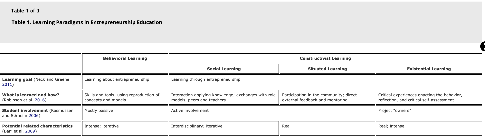
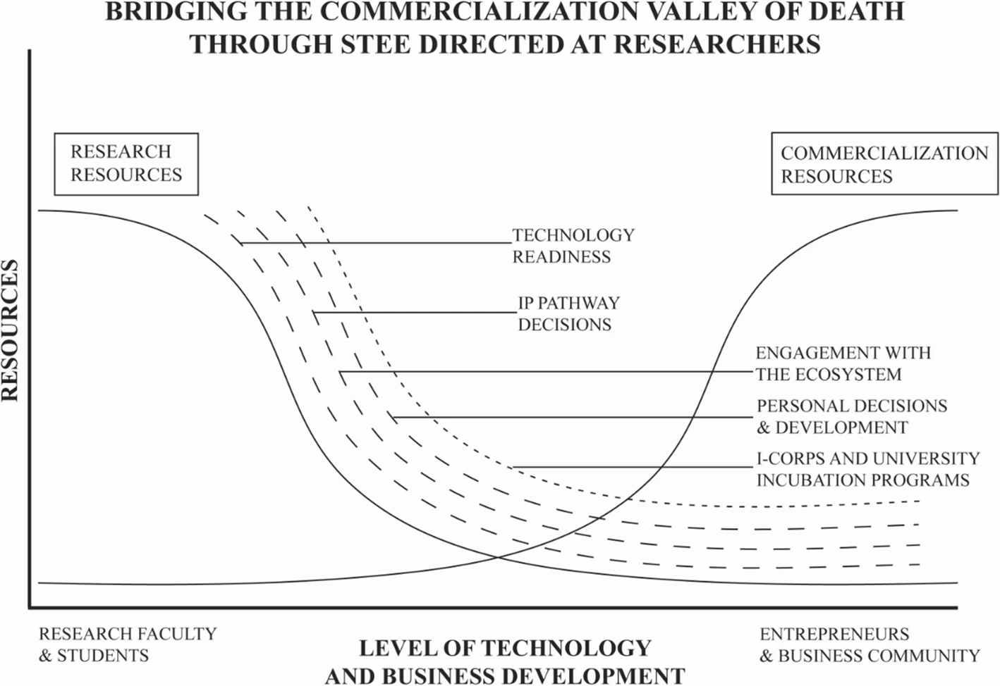

= Technology Entrepreneurship Education

_Keywords:_ technology entrepreneurship, educational robotics, entrepreneurship, innovation, Arduino workshop, Raspberry Pi Pico, cross-disciplinary, academic entrepreneurship, science and technology entrepreneurship education (STEE)

*Technology entrepreneurship* is the interface between the more established academic fields of entrepreneurship and technology based innovation.

== Objectives for the learners

- develop effective problem-solving skills
- decompose problems into smaller parts
- use pseudocode as a tool for sequencing actions
- use existing code with attributes to recognise patterns
- systematically identify and fix bugs
- use conditions and compound conditions to program encoded devices
- prepare learners to participate in international competitions

== Key Objectives

- use decomposition skills to break a complex problem down into smaller parts
- identify and fix programming problems
- develop their ability to recognise patterns and create effective programs
- explore conditional programming
- be able to explain the principle of digital security
- use computational thinking skills to produce a complete solutions to a problem
- create and follow a set of step-by-step pseudocode instructions
- decompose, identify, and fix problems in the pseudo code

== Projects

. monitor temperature
. monitor fan speed
. switch power remotely
. IoT : link:https://www.oracle.com/internet-of-things/what-is-iot/[What is IoT?]
. process automation
. equipment management
. collecting metrics
. IoT of agriculture
  * agtech
  * food production practices
  * monitoring crops, soil, fields, livestock, storage facilities
  * smart agriculture vehicles, drones, autonomous robots, actuators
  * connected agriculture spaces, smart greenhouses, hydroponics
  * data analytics, visualization, management systems
. thermal camera with Raspberry Pi
. cybersecurity with Raspberry Pi
. Christmas light decoration
. portable security box
. network performance monitor
. Wordpress host
. host an Apache server
. chemical experiments facilitated with electronic microcontrollers (see link:https://doi-org.proxy.bnl.lu/10.1038/s41596-019-0272-1[Nature Protocols])
. systems biology (see link:https://doi-org.proxy.bnl.lu/10.1038/s41598-021-89676-5[Nature Scientific Reports])
. healthcare (see link:https://doi-org.proxy.bnl.lu/10.1038/s41598-021-87177-z[Nature Scientific Reports])
. logistics

== Lesson plan

The following table is taken from link:https://education.lego.com/en-gb/lessons/prime-kickstart-a-business[Kickstart a business (Lego Education)]

[cols="1,1,1,1,1,1,1"]
|===

|
| Prepare
| Engage
| Explore
| Explain
| Elaborate
| Evaluate

| 1. Placing your order
|
|
|
|
|
|

| 2. Out of order
|
|
|
|
|
|

| 3. Track your parcels
|
|
|
|
|
|

| 4. Keep it safe
|
|
|
|
|
|

| 5. Keep it really safe!
|
|
|
|
|
|

| 6. Automate it!
|
|
|
|
|
|

| 7. Back to back
|
|
|
|
|
|

|===

== Notes:

"
Technology entrepreneurship focuses on the commercialization of emerging
products and services based on novel technology inventions in either nascent
or established markets. It is an inherently interdisciplinary field of study
as it is closely related to entrepreneurship as a discipline in terms of
methods and tools, while the context is that of science and engineering.
"

"... the respective researchers have oftentimes neither experience nor interest in entrepreneurial activities as it is not part of their profession and training ..."

"... while engineering education had a clear focus on the development and application of technology without any  relation  to  market  contexts,  entrepreneurship  education  pursued  the  objective  to  create  new products,  services,  and  ultimately  ventures. Technology  entrepreneurship  education  aims  to  bridge this  gap  between  the  disciplines  with  the  objective  to  develop  entrepreneurial  knowledge  and competences along in-depth understanding of technology."

"It is undisputed that context has a major impact on learning outcomes in educational activities of any kind. (...)"

"The  context-dependency  of  educational  specifics  (such  as  the  pedagogical  approach, teaching  activities,  desired  learning  outcomes,  etc.)  deserve  special  attention  when  educational activities that were developed in the context of a specific discipline get transferred to the context of a different discipline."

"pedagogical   specifics   of engineering  education  need  to  be  considered  in  this  alignment  as  the  interdisciplinary  nature  of technology entrepreneurship and related education objectives call for interdisciplinary approaches in the design of suitable pedagogy."

"Engineering education typically assumes a problem-based and application-oriented approach in the design  of  pedagogical  methods. This  is  primarily  due  to  the  requirement  of  application-related understanding and  hands-on  experience  of  engineering  graduates."

"The  introduction  of  entrepreneurship  content  in  engineering  education generates new pedagogical models for achieving desired learning outcomes that can in turn greatly enrich entrepreneurship education."

"An important contextual element of engineering education is the use of laboratories and workshops in the development and application of technical products and systems."

"The use of spaces, e.g. laboratories and workshops, creates a reference to real-world problems and contextualizes learning content and objectives  in  application-oriented  scenarios. This  happens  for  instance  through  the  use  of  novel technical equipment, software development, and exercises in prototype development that mirror the activities and tasks of potential future engineering professions."

"Even more important than the impact of specific spaces is the contact and collaboration of communities of practice related to those spaces. For example, the feedback and support from professional engineers regarding the development of a technical  prototype  creates  an  in-depth  learning  experience for  students that  exceeds  classroom learning."

"The  need  for  professional  input  from  both  the  engineering  and  the entrepreneurship disciplines calls for a close interdisciplinary collaboration of academic staff such as researchers  and  lecturers."

" the introduction of entrepreneurship content and methods in the engineering context leads to a change of education outcomes, such as knowledge, skills and capabilities, but potentially also to entrepreneurial engagement of academic staff that has previously been  unaware  and/or  uninterested  in  entrepreneurship."

" (...) technology  entrepreneurship  plays  a conducive role in universities’ socio-economic engagement, because it offers alternative models for transferring knowledge and technology from academia to society and economy."

-- link:https://link.springer.com/referenceworkentry/10.1007/978-981-13-2262-4_172-1[Technology Entrepreneurship - Enriching Entrepreneurship Education]

link:https://www.youtube.com/watch?v=hbP9SgteURM[Technology Entrepreneurship: Lab to Market (HarvardX and edx.org)]

"... they can freely exchange ideas and network with their fellow ..."

"... designed  to  provide  a  rich  and  supportive environment for learning about entrepreneurship, forming   teams,   starting   companies   and   sharing   lessons learned ..."

"The course is team-taught by instructors with substantial technology  and  business  teaching experience ..."

"Topics that are taught include: "

-- link:https://www-sciencedirect-com.proxy.bnl.lu/science/article/pii/S0166497216302619?pds=1582021112447187012537751707846154[Teaching and research opportunities in technology entrepreneurship]

"An example is the link:http://www.universitas21.com/[Universitas 21 Global Ingenuity Challenge]. Here globally dispersed students are invited to work in virtual cross-disciplinary teams to address grand societal challenges."

"Technology entrepreneurship is defined as the interface between the more established academic fields of entrepreneurship and technology based innovation (Beckman et al., 2012)."

-- link:https://onlinelibrary-wiley-com.proxy.bnl.lu/doi/full/10.1002/sej.1134[Technology entrepreneurship]

-- link:https://ieeexplore.ieee.org/abstract/document/1263299[Holistic approach for technology entrepreneurship education in engineering]

"Central to the study of entrepreneurship is its focus on the creation and discovery of novel opportunities."

"... technology entrepreneurship is critically concerned with technical innovations and the nascent markets and novel products they often enable."

link:https://www-tandfonline-com.proxy.bnl.lu/doi/full/10.1111/jsbm.12514[The Learning Process in Technology Entrepreneurship Education—Insights from an Engineering Degree]

"While engineering education in the technical faculties focused on technology creation, entrepreneurship education in the business management faculty promoted the commercialization of products or services through the creation of new ventures."

"According to Robinson et al. (2016), the behavioral learning perspective is aligned with the objective of “learning about” entrepreneurship, while the constructivist learning perspective emphasizes “learning through” entrepreneurship."

"Teaching models for technology entrepreneurship should therefore reflect the specific nature of the technology entrepreneurship process. As discussed by Thrane et al. (2016), such teaching models should not only reflect the intended entrepreneurship learning process, but also the understanding of the elements that build the entrepreneurial process."

"Using the case study of a degree program at the North Carolina State University, Barr et al. (2009) identified four characteristics that are necessary for an effective teaching model in technology entrepreneurship education. "

"While some entrepreneurship education programs focused on the individual with the aim to shape an entrepreneurial mind‐set, others emphasized the generation of new start‐ups and thereby attempted to effectively accelerate the intention‐to‐behavior transition (Nabi et al. 2017)."

-- link:https://link.springer.com/article/10.1007/s10961-020-09787-5[Addressing academic researcher priorities through science and technology entrepreneurship education]

"... incentivizing researchers to move discoveries beyond the laboratory and into society."

"... additional expectations on Ph.D. students and faculty in science and engineering disciplines, who are encouraged to explore the commercialization of their research to promote the role of universities in innovation and job creation."

".. we propose a course model for science and technology entrepreneurship education that has been designed to enable academic researchers to play a more active and informed role in the commercialization of their discovery."

"... traditional Ph.D. training is not designed to prepare researchers to participate in entrepreneurial activity, and therefore its relevance to scientific work may not be evident ..."

"Conventional science and technology entrepreneurship education (STEE) models often position the activity of commercialization (i.e., business) as separate from discovery (i.e., science), resulting in gaps in knowledge across disciplines (Libecap and Thursby 2008)."

"... most scientists lack an understanding of business and commercial opportunities, resulting in university startups that are more technology-driven, rather than market-driven (Druilhe and Garnsey 2004)."

"It has been suggested that entrepreneurship education can be an efficient and effective way to build the transferable skills that are necessary for employment in both academic and non-academic contexts (Duval-Couetil and Wheadon 2014)."

"The academic field of entrepreneurship education tends to differentiate course and program offerings based on whether they are “education about entrepreneurship” (i.e., learning) or “education for entrepreneurship” (i.e., doing) (Mauri Laukkanen 2000). "

"Research suggests that these types of authentic, interdisciplinary, and immersive experiences can bridge the transition from an idea or concept to the introduction of product for those who choose to participate (Barr et al. 2009; Thursby et al. 2009). They benefit scientists and engineers who, without training, may be less likely to engage in commercialization. They also provide aspects of business education that prepare scientists for management roles early in their careers (Barr et al. 2009)."

"However, some scholars have indicated that too much emphasis on practical experience may have negative consequences because “the mental models that such pedagogies create can quickly become obsolete, particularly in light of the fast evolving technologies the curricula are supposed to address” (Locke and Schöne 2004, p. 332). This means that these immersive experiences may inspire students to become more entrepreneurially-oriented, but neglect their development of “critical thinking skills, such as the ability to assess risk, and recognize the inevitable downsides of entrepreneurial activity” (Phan et al. 2009, p. 332)."

"Business decisions are data driven but are often made with incomplete information, and can be influenced by stakeholder interests (Mintzberg et al. 1976)."

"In business, you often need to make educated guesses. This is hard for scientists, who are used to making evidence-based predictions. (Pierce 2008)"

link:https://polytechnic.purdue.edu/profile/natduval[Nathalie Duval-Couetil],
link:https://engineering.purdue.edu/LORRE_Dev?_ga=2.4911478.433935425.1629276304-1124182012.1629276304[Michael Ladisch],
link:https://www.depts.ttu.edu/education/our-people/Faculty/soohyun_yi.php[Soohyun Yi] (Her scholarly trajectory aims to improve education for underserved and underchallenged students with impactful research and evidence-based interventions.)

"To clearly differentiate our course from other campus offerings and its emphasis on university-based startups, we titled the course: “Life of a Faculty Entrepreneur: Discovery, Development & Translation” (abbreviated as LFE)."

"The purpose as stated in the syllabus is: The intent of the course is to complement graduate student research activities and not detract from them in terms of content and time. Students are challenged to think systematically and analytically about processes that move research beyond publications, papers, and patents in order to initiate commercialization. We do not expect that all participants will have a technology that is ready for commercialization, which is often the case in other programs. Rather, our goal is to provide frameworks that will help university entrepreneurs define possible entry points to the commercialization process, and determine their best options prior to getting started."

"Readings and videos from Harvard Business Review, The Wall Street Journal, Science, and Nature serve as the foundation for discussions on technology-based businesses, business models, investments, and leadership."

== Sources:

* link:https://a-z.lu/primo-explore/fulldisplay?docid=TN_informaworld_s10_1111_jsbm_12514&context=PC&vid=BIBNET&search_scope=All_content&tab=all_content&lang=fr_FR[The Learning Process in Technology Entrepreneurship Education]
* link:https://a-z.lu/primo-explore/fulldisplay?docid=EBOOKMMEBOOKCENTRALANNUALEBC275471&context=L&vid=BIBNET&search_scope=All_content&tab=all_content&lang=fr_FR[Entrepreneurship education]
* link:https://a-z.lu/primo-explore/fulldisplay?docid=EBOOKMMEBOOKCENTRALDDAEBC5982452&context=L&vid=BIBNET&search_scope=All_content&tab=all_content&lang=fr_FR[Entrepreneurship Education : Begriff - Theorie - Verständnis]
* link:https://a-z.lu/primo-explore/fulldisplay?docid=EBOOKMMDOAB43510&context=L&vid=BIBNET&search_scope=All_content&tab=all_content&lang=fr_FR[ The Change Laboratory for Teacher Training in Entrepreneurship Education]
* link:https://a-z.lu/primo-explore/fulldisplay?docid=TN_proquest1848485342&context=PC&vid=BIBNET&search_scope=All_content&tab=all_content&lang=fr_FR[Teaching and research opportunities in technology entrepreneurship]
