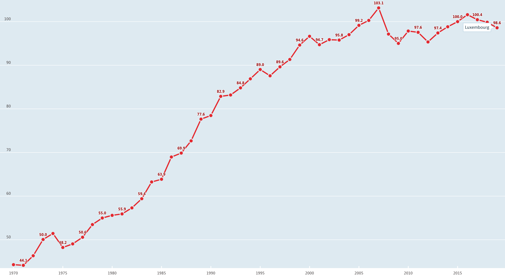

= Is the _Productivity Puzzle_ linked to Maths Teaching in the _Secondary Education System_?

A couple of years ago, economists brought to our attention the
link:https://www.ons.gov.uk/employmentandlabourmarket/peopleinwork/labourproductivity/articles/whatistheproductivitypuzzle/2015-07-07[productivity puzzle] in the UK.
The productivity that has been trending upwards since the 90s started first to
fall during the 2008-09 financial crisis and since 2010 to follow a flat growth
path. A similar pattern can be observed in Luxembourg. In this work, I discuss
the possible role that mathematics in secondary school curriculum can play for
tackling this issue.

As illustrated below, the slowing growth in productivity, even a stagnation,
is also present for Luxembourg. There has
been a steady growth between 1970 to 2008. Following the financial crisis,
productivity stopped growing. A drop in productivity following a crisis is
not uncommon and documented in the economics literature (see link:https://casee.asu.edu/upload/Prescott/2012-McGrattan-GPDER-The%20Great%20Recession%20and%20Delayed%20Economic%20Recovery%20A%20Labor%20Productivity%20Puzzle.pdf[McGrattan and Prescott, 2012]).
What _is_ uncommon is the length of the stagnation, which has last now for ten years.

One major difference between Luxembourg and the UK is related to
unemployment. Following a sharp
increase in unemployment in the UK after the 2008-09 crisis, unemployment has
been steadily decreasing until the recent covid19 crisis. For many this was
the main factor for the fall in productivity in the UK. This would also make
sense since the way productivity is calculated is to divide GDP by the number
of workers or the hours worked. If you reduce the number of workers, respectively
the hours worked, productivity will start to increase. There is a mechanism in
our economies that regulates this. As unemployment falls, wages should start
to increase since labor is becoming scarce. However this could not be observed
in the UK economy, pushing the unemployment to lower levels.

If we look at the case for Luxembourg, we cannot see the same pattern.
While productivity is falling similar to the UK, unemployment in Luxembourg
has shown an increasing trend since the 2008-09 crisis
(see link:https://data.oecd.org/chart/6let[figure]).

[#img-productivity-puzzle]
.OECD Chart: GDP per hour worked, Total, 2015=100, 1970 – 2019
[link=https://data.oecd.org/chart/6l1p]

This change in the productivity pattern may not only have serious consequences
on the economy, but also on the society. If we focus our attention on the
pension system, we can see that the number of workers per social security
retiree has been falling over past decades. This trend can only be sustainable
if the productivity of the workers increases steadily over time.
If, in 2020, there are four workers supporting the pension of a retired worker,
we expect that in 2050 there will only be two workers supporting the pension
of future retired workers. This trend is not shocking and can be observed in
many Western countries. This would also be sustainable if the two workers in
the future were more productive than today's four workers. If we look at the
data in the table above and compare the level of productivity in 2010 with the
one in 1980, we can observe an approximate 80% growth. The social consequence
of this could be lower pensions in the future making the elder population even
more vulnerable due to rising caring home costs.
The following
table gives the _old-age to working-age demographic ratio_, which is defined as
the number of individuals aged 65 and over per 100 people of working age
defined as those at ages 20 to 64.

*Table 1*: Demographic old-age to working-age ratio: Historical and projected values, 1950-2080 (Source: link:https://www.oecd-ilibrary.org/sites/e2839a52-en/index.html?itemId=/content/component/e2839a52-en[OECD])
|===
|Year    |1960  |1990 |2020 |[red]#2050# |[red]#2080#

|
|17.6
|21.1
|22.3
|43.8
|50.1

|===

The economic costs would be multiple. A country with lower productivity means
it will be less attractive for foreign investments and companies. As a country
attracts less capital, it will be more difficult to renew existing productive
capital. This is the reason why recent governments have focused on innovation
and R&D. In the current context, this seems to be the only way to attract
investments and increase our productivity. Massive investments into a
university, research labs, space-mining, supercomputers (like the Meluxina project) are
essential. But we have also to think about the future workforce that will
be active in those fields, which brings us to the education system.

In the Luxembourg education system the impact of socio-economic background
on mathematics performance is above the OECD average (Source: link:https://www.oecd.org/luxembourg/Education-Policy-Outlook-Country-Profile-Luxembourg.pdf[OECD]).
As a consequence learners coming from a difficult socio-economic background may
consistently perform less well in tests and in the education system, in general.
However good level of
Mathematics is required in many subjects such as Physics, Economics, Biology.
Students with an insufficient level of Mathematics will be pushed into
sections or streams that have no or very light Mathematics in the curriculum.
Those who are lucky to make it into sections/streams that requires Maths
will systematically under-perform.

[short presentation of the Luxembourg school system, use a simplified graphics from mengschoul.lu]

And low-performing students can hamper productivity.
Therefore one strategy would be for schools to adress maths and science literacy
for the large numbers of low-performing students
(link:https://doi-org.proxy.bnl.lu/10.1038/453028a[Nature 453, pages 28–30(2008)]).
This would have to start before the learners are streamed, which happens at 4eme.
Therefore the key years during which learners have to stimulated in the field of
mathematics would be 7ieme, 6ieme and 5ieme.

Maths and technology education is not only required in today's society but
it plays a crucial role.
In many cases, technical knowledge is a prerequisite for participating in
public debate. Then there is all the technology in everyday life that needs to
be operated. Financial education, which helps youngsters to make the right
consumption, saving and investment decisions requires also basic maths knowledge.

In the UK, it has been shown that the main sectors responsible for the fall
in productivity are finance, utilities, pharmaceuticals, computing and
professional services. Most of these industries rely on innovation and staff
who can be technically challenged by a fast changing environment. A similar study
must be undertaken for Luxembourg. We must identify which sectors are concerned
and rapidly adapt our education system to fix these issues.

== Concluding Remarks

One assumption of the falling productivity growth is that the education system
in the UK has changed throughout the past decades. Vocational training was
devalorized against university studies.

Another assumption is a reform that made it easier for students to
skip Maths for their A-level. Lack of mathematical skills could be the
source of the loss in productivity. Especially since future jobs will
rely on coding and solving complex problems, that can only be solved using
mathematical tools (e.g. coding is today present in linguistics, paleonthology,
biology, ... fields that used to be exempt of coding and maths).

We have to start early on (e.g. 7ieme, 6ieme) not only to win youngsters into
fascinating field of applied mathematics but also to actively design strategies
to avoid losing them.

For this we must make use of all the tools designed in STEM teaching. Coding
robots has to be part of the curriculum in Maths. Students must be introduced
to mathematical concepts together with applied maths in robotics/Python.

== References

. link:https://www.purdue.edu/hhs/hdfs/fii/wp-content/uploads/2015/07/s_iafis04c02.pdf[Successful K–12 STEM Education: Identifying Effective Approaches in Science, Technology, Engineering, and Mathematics.]
. link:https://doi-org.proxy.bnl.lu/10.1038/nj7354-130a[Better teaching needed.]
[quote]
(...) The authors  also recommend improving STEM literacy to fill STEM-related jobs that do not require advanced degrees, such as science teacher or energy technician. The US Bureau of Labor Statistics says that only 4 of the 16 STEM-related jobs with the largest projected growth by 2018 need an advanced degree.
. link:https://doi-org.proxy.bnl.lu/10.1038/d41586-020-00896-7[Five tips for moving teaching online as COVID-19 takes hold.]
.. *Reduce your goals* and make *short videos* that are no longer than 30 minutes. Identify a few specific things that you want your students to learn, and focus on those.
.. Don't rely exclusively on *live video*.
.. Set up your courses so that students can pursue *self-paced enquiry* -- exploring the topic under their own initiative. Give students a range of links for further reading. Find out what students most care about. Ask students what they hope to get out of the online course, and how you can best serve them. This will offer you ideas for teaching and give students ownership of the process.
.. Consider interactive elements such as *short quizzes*. Engage them with *opportunities to talk to one another* during a live session. Make sure students *support each other*. Don’t try to do everything yourself.
.. Conduct *frequent assessments*, and check in by phone, text or e-mail with each student — most often with those who are struggling.
. link:https://doi-org.proxy.bnl.lu/10.1038/277344a0[Does the UK have a numeracy problem?]
[quote]
(...) "I think there is no doubt that there is something of a crisis in the teaching of mathematics." attributing the crisis to the introduction of "a lot" of new methods, too rapid change of curriculum and a shortage of skilled teachers.
[quote]
(...) A major facet is that the problems of numeracy and literacy are intertwined. There are very few people who can work with numbers without being able to read and as such many numeracy problems are handled within the much larger literacy programmes.
. link:https://doi-org.proxy.bnl.lu/10.1038/453028a[Making the grade]
[quote]
If, as we argue, average test scores are mostly irrelevant as a measure of economic potential, other indicators do matter. To produce leading-edge technology, one could argue that it is the numbers of high-performing students that is most important in the global economy. These are students who can enter the science and engineering workforce or are likely to innovate whatever their field of study.(...) At the same time, *low-performing students can hamper productivity* (...)
[quote]
Without a doubt, science, maths and technology education is needed in today’s society, whether for its citizens to understand enough to participate in public debate or just to operate the technology of everyday life. However, some argue for more advanced courses as if they want to prepare all students to be scientists or engineers. (...) History suggests that policies designed to stockpile scientists and engineers are counter-productive.
[quote]
(...) Our analysis of the data suggests two fundamental problems that require different approaches. First, *pedagogies must address science literacy for the large numbers of low-performing students*. Second, education policy for our highest-performing students needs to meet actual labour-market demand.
. link:https://doi-org.proxy.bnl.lu/10.1038/d41586-018-06830-2[Better teachers are needed to improve science education.]
[quote]
Every kid starts out as a natural-born scientist, and then we beat it out of them. A few trickle through the system with their wonder and enthusiasm for science intact.(Carl Sagan)
[quote]
Improving outcomes, says Peter McLaren, executive director of the non-profit initiative Next Gen Education, will require a shift in the classroom from a teacher-centred approach to one that helps students work through concepts themselves.
[quote]
However, some of the concepts might not translate easily. Some systems are built around strict standards or large class sizes that would make it difficult for teachers to give students the focused, personalized guidance they need.
[quote]
One realization was that trying to explain concepts and then have students apply them — or worse, simply regurgitate them — did not work. Instead, teachers should create projects in which concepts become apparent as students work through real-world challenges.
[quote]
. link:https://marianamazzucato.com/books/mission-economy[Mission Economy]
[quote]
The number of workers per social security retiree in the USA has fallen from 16:1 in 1950 to about 2:1 today. But if those two workers are much more productive than their 16 grandparents in 1950, the pensions will go on being paid.
. link:https://tradingeconomics.com/luxembourg/productivity[Luxembourg Productivity]
. link:https://data.oecd.org/chart/6l0f[GDP per hour worked (Luxembourg 1970--2019, OECD data)]
. link:https://doi-org.proxy.bnl.lu/10.1057/s41599-020-00597-6[Technical communication pedagogical model (TCPM) for Malaysian vocational colleges]
. link:https://data.oecd.org/chart/6l8m[Employee compensation by activity: Total, % of gross value added 1970 – 2020, Annual]
. link:https://data.oecd.org/chart/6l8j[Average wages: Total, US dollars, 1990 – 2019]
. link:https://data.oecd.org/chart/6l8n[Labour force participation rate: 25-64 years olds, % in same age group 1983 – 2019, Annual]
. link:https://www.ft.com/content/a470b09a-4276-11ea-a43a-c4b328d9061c[The UK’s employment and productivity puzzle]
[quote]
A link:https://voxeu.org/article/paradox-stagnant-real-wages-yet-rising-living-standards-uk[recent article by three economists], including David Hendry of Oxford
university, a distinguished econometrician, sheds bright light on what has
happened. Productivity and real wages have stagnated since 2007. But real GDP
per head is up by 20 per cent since 2000 and 10 per cent since its trough in
2009.
[quote]
We do not know why this has happened. But one reason, surely, must be the
fact that over 2010-19, the UK’s average investment as a share of GDP has
been the second lowest in the EU (ahead only of Greece).
[quote]
As one would expect, real wages have tracked productivity very closely over
the entire period since 1860, including the recent period: stagnant
productivity has meant stagnant real wages.
[quote]
link:https://www.ft.com/__origami/service/image/v2/images/raw/http%3A%2F%2Fcom.ft.imagepublish.upp-prod-eu.s3.amazonaws.com%2F697eccaa-4376-11ea-a43a-c4b328d9061c?dpr=2&fit=scale-down&quality=medium&source=next&width=700[The flatline trend in productivity since the Great Recession is unprecendented in 160 years.]
[quote]
Yet, despite the stagnant real wages, real GDP per head is up significantly.
The explanation for this divergence between real wages and GDP per head is
the rise in employment relative to the population as a whole.
[quote]
After a sharp fall during the crisis, employment again grew faster than the
population: between 2009 and 2018, employment rose 12 per cent, while
population rose only 7 per cent.
[quote]
(...) )with a lower rate of growth of employment, it is likely that
productivity will rise somewhat. Since one explanation for the productivity
stagnation was the lower marginal product of labour in a rapidly growing
labour force.
. link:https://www.ft.com/content/8fc12094-52f7-11ea-90ad-25e377c0ee1f[UK’s industrial strategy criticised by independent body]
[quote]
Andy Haldane, chief economist of the Bank of England, and chair of the
Industrial Strategy Council, said: “An effective industrial strategy is
central to tackling some of the deep-seated structural challenges facing
the UK economy, among them the climate crisis, ‘levelling-up’ the regions,
the skills deficit and the productivity puzzle.
[quote]
It also called for *reform of the apprenticeship system* and said much
*more funding would be needed for further education*, with recent
initiatives on skills likely to “fall well short of the scale necessary”.
. link:https://www.ft.com/content/8776d110-5232-11ea-8841-482eed0038b1[Wage growth slows despite robust labour market]
[quote]
Labour productivity, which measures output per worker, contracted 0.5 per
cent in the last quarter of 2019 compared with the previous quarter,
reflecting the rise in jobs against a backdrop of a stagnating economy.
The key indicator has contracted for three of the past five quarters,
further underlining the “productivity puzzle” that has seen the UK
underperform its peers since the international crisis.
[quote]
link:https://www.ft.com/__origami/service/image/v2/images/raw/http%3A%2F%2Fcom.ft.imagepublish.upp-prod-eu.s3.amazonaws.com%2Fff5beb60-523d-11ea-8841-482eed0038b1?dpr=1&fit=scale-down&quality=highest&source=next&width=700[UK productivity is well below the pre-crisis trend]
link:https://www.ft.com/content/c4c4f9e6-ca22-11e8-9fe5-24ad351828ab[Andy Haldane tapped to tackle UK’s productivity puzzle]
[quote]
Mr Haldane, in a lecture in 2016, cited the limitations of monetary policy
and quoted the US economist Paul Krugman, who said: “Productivity isn’t
everything but, in the long run, it is almost everything.”
[quote]
The appointment was given the blessing of Mark Carney, BoE governor,
who said: “Productivity is an important determinant of the MPC’s forecasts
for economic growth and inflation.
. link:https://www.ft.com/content/399ba61a-9fa9-11e8-b196-da9d6c239ca8[Conventional measures pose the wrong productivity question]
[quote]
In a link:https://ideas.repec.org/p/ecl/stabus/repececlstabus3592.html[recent paper]
a group of economists from Stanford University and the
Massachusetts Institute of Technology — two of the world’s hot springs
of idea-generation — calculate that it now takes more than 20 times the
number of researchers to generate the same economic growth as it did in
the 1930s.
[quote]
Studies of specific phenomena support the slowdown hypothesis: Moore’s
law is fizzling out; new pharmaceutical products take far more investment
than they used to; agricultural productivity seems to have ground to a halt.
[quote]
One explanation for the combination of dismal productivity figures and
exciting innovation is delay: *it takes a long time for new technologies
to be turned into widely used commercial applications*. The *more fundamental
the innovation, the longer the lag* is likely to be.
This was true for electricity, for computers in the early days, and
will be true for newer technologies such as AI. Other potential factors
include demographic change, the hangover from the financial crisis and
misallocation of capital.
[quote]
Another explanation favoured by some economists — and by the tech
community — is that output, and therefore productivity, are being
mis-measured. The Stanford/MIT paper defines an “idea” as a unit of national
output (as currently measured) divided by the total number of researcher hours.
(...)
The answer, in part, is because of the way economic output, as gross domestic
product, is defined.
[quote]
For one thing, it excludes unpaid work in the home. Hence the steady
transition of women into paid work during the second half of the 20th
century flattered that era’s growth and productivity figures. For another,
the investment figures included in GDP have omitted intangible investments,
including in ideas. Statistics agencies are only just starting to incorporate
these, so all of those researchers have been generating some uncounted output.
. link:https://www.ft.com/content/5eed874e-7abf-11e8-8e67-1e1a0846c475[The BoE cannot solve the productivity puzzle]
[quote]
The reality is that no one has a precise understanding why productivity in
the UK has been so weak. The location of the problem, however, has been
identified. There is ample new evidence that it is the *biggest and best
companies* that have been *falling short of their historical performance*.
According to the Economic Statistics Centre of Excellence, three-fifths
of the drop in productivity growth stems from sectors representing only a
fifth of output, including *finance, utilities, pharmaceuticals, computing
and professional services*.
[quote]
The UK’s *labour productivity underperformance* is at least partly the
*flipside of the rise in employment*. Yet the *continued failure of wage
growth to rise* as the BoE has expected suggests that the central bank could
run the economy quite a lot hotter until it begins to run out of workers.
Along the way, productivity is likely to rise, as it tends to do in booms,
when companies start to look for efficiency improvements.
. link:https://data.oecd.org/chart/6lep[Unemployment rate: Total, % of labour force, Jan 1983 – Feb 2021]
. link:https://data.oecd.org/chart/6leq[Unemployment rateTotal, % of labour force, Jan 1983 – Feb 2021; UK vs. Luxembourg]
. link:https://www.ft.com/content/1043eec8-e9a7-11e9-a240-3b065ef5fc55[Fall in UK labour productivity is worst in 5 years]
[quote]
Output per hour worked, the standard measure of productivity, dropped 0.5
per cent over the three months to June, compared with the same quarter last
year, the worst performance since the April-June period in 2014, the Office
for National Statistics (ONS) reported on Tuesday. It follows two quarters
of stagnation.
[quote]
Productivity is considered the single most important determinant of a
country’s standard of living and lack of growth limits a country’s ability
to become richer.
[quote]
Many economists and businesspeople point to the lack of business investment
as a reason for deteriorating productivity.
[quote]
"The low cost and flexibility of labour relative to capital has certainly
supported employment over investment," said Howard Archer, chief economic
adviser at EY Item Club, a consultancy.
[quote]
As the Brexit deadline approaches, businesses have been more inclined to
postpone costly investment.
[quote]
Utilities and construction were the only sectors which recorded a rise in
productivity, while output per hour fell 1.9 per cent in the manufacturing
sector and by 0.8 per cent in the services sector. Services account for about
80 per cent of the UK economy.
[quote]
Nicholas Bloom, professor of economics at Stanford University, calculated
in a paper published in September that Brexit had reduced UK productivity
by between 2 per cent and 5 per cent over the three years since the referendum.
A large part of the reduction was because companies were "committing several
hours per week of top-management time to Brexit planning".
.link:https://www.ft.com/content/0ac0b74e-7727-11e9-be7d-6d846537acab[Podcast: Why are women less confident with numbers than men?]
[quote]
Mr Seagull says: "Girls actually have a lack of confidence in their ability,
even if actually on paper, and results wise they are just as good as the
boys. Clearly it’s something that’s happening, not just in the classroom
but in society as well."
[quote]
"Roughly half of adults are at primary school levels in terms of their
number understanding," he says. "So we have a big issue in that this
underpins our productivity puzzle in the UK and some of the issues we have
around financial capability in this country."
. link:https://www.ft.com/content/6f6ef53a-9f08-11e9-9c06-a4640c9feebb[UK productivity contracts for third consecutive quarter]
[quote]
Katherine Kent, head of productivity at the Office for National Statistics,
the UK statistical agency, said: "Our latest figures represent a continuation
of the UK's productivity puzzle. This sustained stagnation in productivity
in the last decade is at odds with what we’ve seen after previous economic
downturns."
[quote]
Since the financial crisis, productivity has largely stagnated.
This contrasts with previous downturns, when productivity initially
fell, but then recovered to its previous rate of growth.
[quote]
link:https://www.ft.com/__origami/service/image/v2/images/raw/http%3A%2F%2Fcom.ft.imagepublish.upp-prod-eu.s3.amazonaws.com%2Fd3881e02-9f0d-11e9-9c06-a4640c9feebb?dpr=2&fit=scale-down&quality=medium&source=next&width=700[UK productivity contracts for three consecutive quarters]
[quote]
The decline in productivity in the first quarter was driven by the
manufacturing sector, where output per hour worked fell 0.9 per cent
compared with the same period last year. Productivity in the services
sector increased by 0.2 per cent.
[quote]
. link:https://www.ft.com/content/1976d800-4793-11e8-8ee8-cae73aab7ccb[A German solution to the UK’s productivity puzzle]
[quote]
The UK’s challenge is well known. Since the financial crisis, productivity
has fallen further behind other leading economies such as the US, Germany
and France. At current rates, according to McKinsey visiting fellow Tera
Allas, the UK will by 2025 be nearly a third less productive per hour worked
than Germany.
[quote]
Sir Charlie’s group believes companies can be helped to identify changes
in the way they are managed to deliver concrete improvements, and that
even adopting a few new basic practices can make a real difference. It has
developed a questionnaire (“How good is your business really?”) that
allows managers to assess their company’s productivity in categories such
as leadership, employee engagement, planning and digitisation. The group
is also trying to distil and share best practice from business in the UK
and elsewhere. Germany provides particularly useful examples.
[quote]
Output per hour worked in Germany is more than a quarter higher than
in the UK. There are several reasons behind this, but one of the most
useful for managers lies in the way big German companies work with their
supply chains. Here, research suggests, companies are simultaneously more
demanding but more collaborative, exacting efficiency gains from their
suppliers but also disseminating best practice down to them. Relationships
tend to be long-term, encouraging innovation to be shared both up and down
the chain.
[quote]
He says companies often think their productivity challenge is in their own
business, when in fact it is about building a whole supply chain that can
respond quickly to customers’ needs.
. link:https://data.oecd.org/chart/6leO[GDP per hour worked: Total - 2015=100 - 1995 - 2020; Germany - France and Luxembourg]
. link:https://press.princeton.edu/books/hardcover/9780691160719/introduction-to-computational-science[Introduction to Computational Science - Modeling and Simulation for the Sciences]
[quote]
Computational science, the fast-growing interdisciplinary field that is
at the intersection of the sciences, computer science, and mathematics,
will require scientists who are appropriately trained. The experts who
produced "Towards 2020 Science" predicted that *future scientists who are
not computationally and mathematically literate will be unable to do science*.
[quote]
"If you look at students coming into our graduate program from the
undergraduate world, *those that haven’t already had some exposure
to computation, such as thinking algorithmically, solving problems on
the computer, and the little bits of applied math* that you need to understand
all of that, ... *have lost a year or two of productivity at the graduate
level*. But it's not only the undergraduate students coming into graduate
school that have this issue; it’s also our undergrads going off into the
larger world. Industry and many other aspects of the commercial world use
simulation and computation in diverse ways"
[quote]
Computational science, which combines computer simulation,
scientific visualization, mathematical modeling, computer programming,
data structures, networking, database design, symbolic computation,
and high-performance computing, can transform practices in a diverse
range of disciplines.
[quote]
Application of computer modeling has fueled the debate in another,
rather unexpected area — linguistics.
[quote]
.. Investigate three applications of computational science involving different scientific areas and *write at least a paragraph on each*. List references.
.. Investigate an application of computational science and *write a three-page, typed, double-spaced paper* on the topic. List references.
[quote]
Cognitive scientists, such as Professor Ken Koedinger at the Human-Computer
Interaction Institute, Carnegie-Mellon University, develop *computer models
of student reasoning and learning* to aid in the design educational
software and to guide teaching practices (Koedinger).
[quote]
Definition: *Modeling* is the application of methods to analyze complex,
real-world problems in order to make predictions about what might happen
with various actions.
[quote]
The steps of the modeling process are as follows:

* Analyze the problem
* Formulate a model
** Gather data
*** Make simplifying assumptions and document them
** Determine variables and units
** Establish relationships among variables and submodels
** Determine equations and functions
* Solve the model
* Verify and interpret the model's solution
* Report on the model
** Analysis of the problem
** Model design
** Model solution
** Results and conclusions
* Maintain the model
. link:https://odc.gouvernement.lu/fr/publications.html?q=productivit%C3%A9[Observatoire de la compétitivité: Publications sur la productivité]
. link:https://www.ft.com/search?q=%22productivity+puzzle%22[BOOKMARK]
. link:https://www.alternatives-economiques.fr/productivite-francaise-a-lepreuve-covid/00095186[La productivité française à l'épreuve du Covid]
[quote]
Cela ne leur interdit pas de formuler une *inquiétude à plus long terme* sur
la « performance médiocre de la France en matière de *formation
initiale et continue* ». Le rapport rappelle que « la France est l’un des
pays de l’OCDE où le *lien entre le statut socio-économique des parents*
et la *performance aux tests [scolaires]* est le plus fort ». Et que le
*système éducatif français reproduit plus que d’autres les inégalités
socio-économiques*, celles-ci se répercutant sur l’accès à l’emploi.
[quote]
Le CNP pointe également le *rôle très marginal qu’a la formation continue
dans la réduction de ces inégalités*, en dirigeant plutôt le système de
formation professionnelle « vers les salariés déjà en emploi que vers
les chômeurs et les personnes en besoin d’insertion professionnelle ».
Plombant d’autant la productivité du travail.
[quote]
Certains désignent déjà les jeunes entrant sur le marché du travail de ces
pays touchés par la récession comme une « génération perdue ». Le postulat
est simple et étayé par de nombreuses études : « Lors d’une récession, la
cohorte de jeunes entrant sur le marché du travail a plus de difficultés à
s’insérer que la cohorte précédente. »
[quote]
Les effets négatifs d’une récession s’illustrent également par d’autres
aspects de la vie sociale : le nombre d’enfants, le taux de divorce, la
santé déclarée ou la mortalité sont autant de facteurs affectés de manière
négative par une entrée sur le marché du travail en période de récession.
Avec un impact immédiat sur la productivité de la cohorte concernée.
[quote]
Le CNP considère le *ralentissement de la productivité du capital humain*
comme la principale source du ralentissement de la productivité globale en
France : « Entre 1976 et 1986, il *contribuait pour 2,2 points à la forte
croissance de la productivité*, de 3,4 % en moyenne annuelle », alors que
« *depuis 2004, sa contribution n’est plus que de 0,6 point* annuellement »
pour une croissance totale de la productivité de 0,7 %.
[quote]
 L’inadéquation des compétences (utilisation sous-optimale des compétences
 d’un individu dans son emploi) est aussi un frein à la productivité que
 soulignent les auteurs du CNP – et que développe longuement un nouveau
 link:https://www.strategie.gouv.fr/sites/strategie.gouv.fr/files/atoms/files/fs-2021-dt-01-inadequation-competences-janvier.pdf[rapport de France Stratégie].
[quote]
Source: link:https://www.strategie.gouv.fr/publications/effets-de-crise-covid-19-productivite-competitivite[le deuxième rapport du Conseil national de la productivité]
. link:https://odc.gouvernement.lu/fr/publications.html?q=productivit%C3%A9[Publications de l'Observatoire de la compétitivité (Luxembourg) sur la productivité]
. link:https://www.escoe.ac.uk/[Economic Statistics Centre of Excellence]
[quote]
 Low productivity is possibly the most important challenge that the UK
 economy faces because it affects the living standards we can sustain.
 Against this background, the disappointing productivity record of many UK
 businesses has provoked significant concern amongst policy, academic and
 business communities. The factors contributing to this picture remain the
 subject of debate. Much can be learned from careful investigation of
 firm-level micro data.
. link:https://www.ft.com/content/8853d9be-af66-11e7-8076-0a4bdda92ca2[Trying to make sense of the UK productivity puzzle]
[quote]
 If we want to get richer, we must be more productive, so there’s a
 “productivity crisis”. Never mind that unemployment is at a 42-year low,
 we are miserably unproductive compared with other countries, and thus
 doomed to stagnant standards of living. These figures imply that, instead
 of getting more efficient, we are simply employing more people.
 But what if we are measuring the wrong things? It’s simple to count cars
 from a factory (although less simple to capture model improvements) but in
 a service economy like Britain’s, measuring output is hard. Is a longer
 newspaper article more productive than a shorter one? What about making
 phone calls on the train? Search? Emails? Same day delivery? All short-circuit
 problems which took hours or even days to solve in the pre-internet era.
. link:https://www.ft.com/content/d8f5322a-5e19-11e8-ad91-e01af256df68[‘Solution’ to UK productivity puzzle is misconceived, study finds]
[quote]
 Low business investment, poor management skills, difficulties in measuring
 the new digital economy and loose monetary policy prolonging the survival
 of “zombie” companies all help to account for the UK’s “productivity puzzle”.
 One other explanation that has heavily influenced policy — highlighted last
 year by Andy Haldane, the Bank of England’s chief economist — is the fact
 that the UK has an unusually long tail of productivity laggards that pull
 down the national average.
[quote]
 The Treasury has also earmarked £20m for a pilot led by Jürgen Maier,
 chief executive of Siemens’ UK operations, which *aims to help small
 businesses in manufacturing supply chains adopt digital technology*.
. link:https://www.centreforcities.org/blog/can-employment-training-help-address-uks-productivity-puzzle/[Can employment training help address the UK’s productivity puzzle?]
[quote]
There is evidence that employment training can be effective in tackling this
issue by not only bringing people back into work but by also helping them
acquire new skills and move up on the earnings ladder. In around half of the
evaluations on this topic reviewed by the What Works Centre (WWC), employment
training had a positive impact on wages and employment.
[quote]
But in terms of outcomes, the way the training is designed matters. Looking at
the duration of trainings, the review found that short programmes are more
effective for less formal training activity while longer programmes generate
gains when the content is skill-intensive but the benefits take longer to
materialize.
[quote]
When it comes to the format of the training, on-the-job training programmes
tend to outperform classroom-based ones. This is because employers engage
directly with the course and the participants tend to acquire skills that
match more closely what employers need. This could also be due to the fact
that the participants have already established a relationship with their
potential employer.
