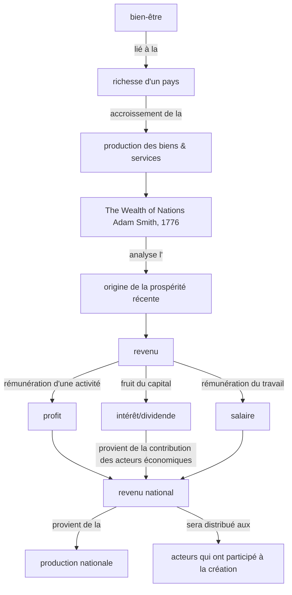
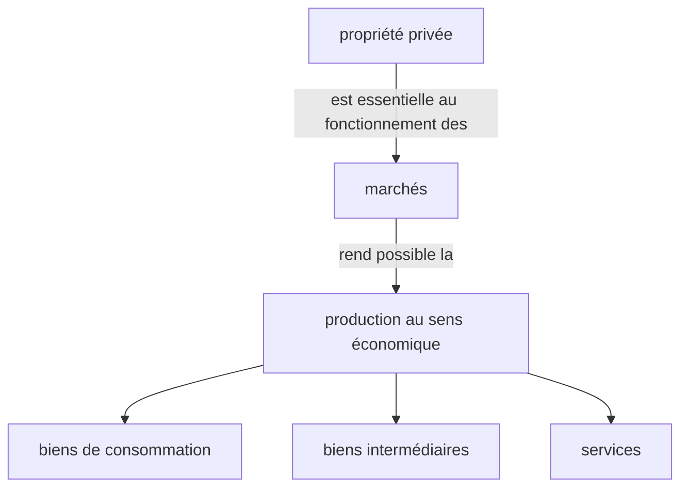
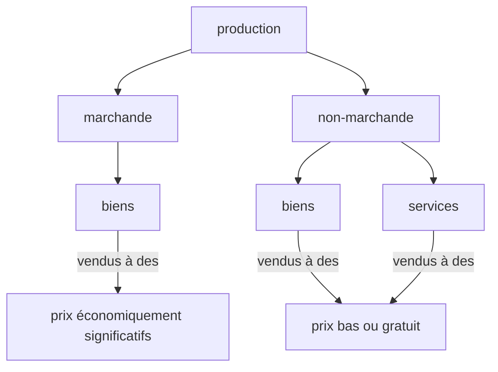
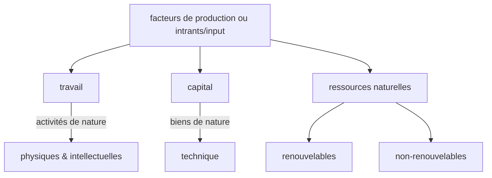
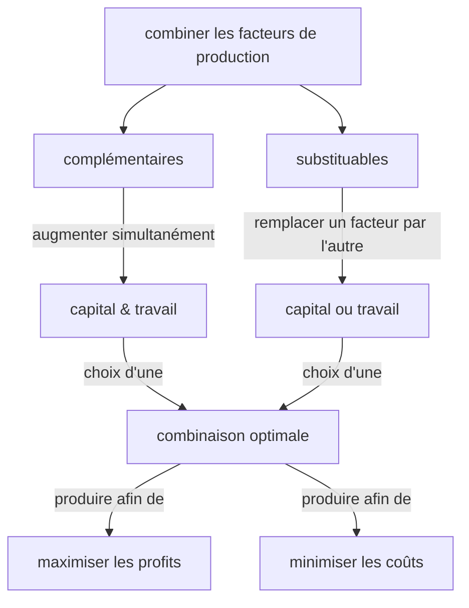

# Chapitre 1: Comment crée-t-on des richesses et comment les mesure-t-on?

Après avoir étudié ce chapitre, vous devriez être en mesure d'expliquer les concepts suivants:

    revenu national, propriété privée, production marchande, 
    production non-marchande, facteurs de production, substitution,
    complémentarité, productivité, productivité du travail,
    productivité globale des facteurs, gains de productivité,
    progrès technique, compétitivité des entreprises, 
    croissance économique, valeur ajoutée, bénéfice,
    PIB réel, PIB nominal, taux de croissance, récession, expansion,
    PIB par habitant, indicateurs complémentaires.


## 1. Introduction: le revenu national

### 1.a. Revenu national



- [An Inquiry into the Nature and Causes of the Wealth of Nations by Adam Smith](https://www.gutenberg.org/ebooks/3300)
- [La richesse des nations par Adam Smith](https://gallica.bnf.fr/ark:/12148/bpt6k75319v.pdf)


## 2. La diversité de la production

### 2.a. Les différents types de bien et services



### 2.b. Production marchande et non-marchande



- **production marchande** :  vendue sur le marché des biens et services à un prix en principe supérieur aux coûts de production
- **production non-marchande** : les biens et services qui sont soit gratuits, soit vendus à un prix inférieur aux coûts de production


## 3. Comment produire et mesurer la production

### 3.a. Les facteurs de production



### 3.b. Substitution ou complémentarité des facteurs de production



- **fonction de production** : décrit la relation entre la quantité produite et les quantités de facteurs de production utilisées à cette fin.
- **intensif en travail** : se dit de l'utilisation d'une plus grande quantité de travail dans la production, comparativement aux machines et autres facteurs de production.


## 4. Comment mesurer la création de richesses d'une nation?

```math
taux\ \ de\ \ croissance = \frac{ variation\ \ du \ \ PIB }{ valeur\ \ initiale\ \ du \ \ PIB }
```

### 4.a. PIB réel annuel (somme annuelle): Luxembourg (source: FRED)

[Produit intérieur brut réel pour le Luxembourg](https://fred.stlouisfed.org/graph/?g=QYll)

[LaTeX source code](https://www.overleaf.com/read/bbgdjfqzrqkp)

")

Source: Eurostat  Release: National Accounts - GDP (Eurostat)  
Units:  Millions of Chained 2010 Euros, Seasonally Adjusted

Frequency:  Quarterly

Eurostat unit ID: CLV10_MNAC
Eurostat item ID = B1GQ
Eurostat country ID: LU

Seasonally and calendar adjusted data.

For euro area member states, the national currency series are converted into euros using the irrevocably fixed exchange rate. This preserves the same growth rates than for the previous national currency series. Both series coincide for years after accession to the euro area but differ for earlier years due to market exchange rate movements.

Copyright, European Union, http://ec.europa.eu, 1995-2016.Complete terms of use are available at http://ec.europa.eu/geninfo/legal_notices_en.htm#copyright

Suggested Citation:
Eurostat, Real Gross Domestic Product for Luxembourg [CLVMNACSCAB1GQLU], retrieved from FRED, Federal Reserve Bank of St. Louis; https://fred.stlouisfed.org/series/CLVMNACSCAB1GQLU, June 26, 2022.

### 4.b. PIB réel annuel (moyenne trimestrielle): Luxembourg (source: FRED)

[Produit intérieur brut réel pour le Luxembourg](https://fred.stlouisfed.org/graph/?g=QYiN)

[LaTeX source code](https://www.overleaf.com/read/bbgdjfqzrqkp)

")

Source: Eurostat  Release: National Accounts - GDP (Eurostat)  
Units:  Millions of Chained 2010 Euros, Seasonally Adjusted

Frequency:  Quarterly

Eurostat unit ID: CLV10_MNAC
Eurostat item ID = B1GQ
Eurostat country ID: LU

Seasonally and calendar adjusted data.

For euro area member states, the national currency series are converted into euros using the irrevocably fixed exchange rate. This preserves the same growth rates than for the previous national currency series. Both series coincide for years after accession to the euro area but differ for earlier years due to market exchange rate movements.

Copyright, European Union, http://ec.europa.eu, 1995-2016.Complete terms of use are available at http://ec.europa.eu/geninfo/legal_notices_en.htm#copyright

Suggested Citation:
Eurostat, Real Gross Domestic Product for Luxembourg [CLVMNACSCAB1GQLU], retrieved from FRED, Federal Reserve Bank of St. Louis; https://fred.stlouisfed.org/series/CLVMNACSCAB1GQLU, June 26, 2022.

### 4.c. Taux de croissance du PIB réel annuel: Luxembourg (source FRED)

[Produit intérieur brut réel pour le Luxembourg](https://fred.stlouisfed.org/graph/?g=QR0p)

[LaTeX source code](https://www.overleaf.com/read/bbgdjfqzrqkp)

")

Produit intérieur brut réel pour le Luxembourg

Variation en pourcentage, corrigé des variations saisonnières

Annuel, Moyenne

Source : Communiqué d'Eurostat : Comptes nationaux - PIB (Eurostat)  

Unités :  Millions d'euros chaînés 2010, corrigés des variations saisonnières

Données corrigées des variations saisonnières et des effets de calendrier.

Pour les États membres de la zone euro, les séries en monnaie nationale sont converties en euros en utilisant le taux de change irrévocablement fixé. Cela permet de conserver les mêmes taux de croissance que pour les séries en monnaie nationale précédentes. Les deux séries coïncident pour les années postérieures à l'adhésion à la zone euro mais diffèrent pour les années antérieures en raison des mouvements des taux de change du marché.


### 4.d. Taux de croissance du PIB réel annuel: Luxembourg (source FRED)

(cf. catégorie précédente pour les sources)

")

| Période       | Description                     |
| ------------- | ------------------------------- |
| 2001Q2-2003Q2 | éclatement de la bulle internet |
| 2008Q2-2009Q2 | crise des subprimes             |
| 2011Q3-2013Q1 | crise grecque, crise espagnole  |
| 2018Q1-2020Q2 | crise économique du COVID-19.   |

[source des crises](https://fr.wikipedia.org/wiki/Liste_des_crises_mon%C3%A9taires_et_financi%C3%A8res)


[INSERT annual real GDP of LUXEMBOURG (with value boxes) here]

[INSERT annual real GDP GROWTH of LUXEMBOURG here]

```math
PIB\ \ par\ \ habitant = \frac{ valeur\ \ du\ \ PIB }{ population\ \ du\ \ pays }
```

### 4.e. Taux de croissance du PIB réel (en %) pour la Chine, les Etats-Unis, la France et le Luxembourg

[source des données (FRED)](https://fred.stlouisfed.org/graph/?g=R2gT)

[code source LaTeX](https://www.overleaf.com/read/bbgdjfqzrqkp)


**!!TBC!!**

## 5. Comment le PIB a-t-il évolué dans le monde à long terme?

### 5.a. Crosse de hockey (avec Luxembourg)


[GDP per capita, 1 to 2018 (Source: Our World in Data)](https://ourworldindata.org/grapher/gdp-per-capita-maddison-2020?time=1252..2018&country=LUX~GBR~USA~DEU~FRA~JPN~CHN~IND)

PIB par habitant, de 1252 à 2018
Ces données sont ajustées pour tenir compte des différences du coût de la vie entre les pays et de l'inflation. Il est mesuré en dollars internationaux constants de 2011.

OurWorldInData.org/economic-growth • CC BY

Source: Maddison Project Database 2020 (Bolt and van Zanden, 2020)

")


## 6. Les indicateurs complémentaires

...


